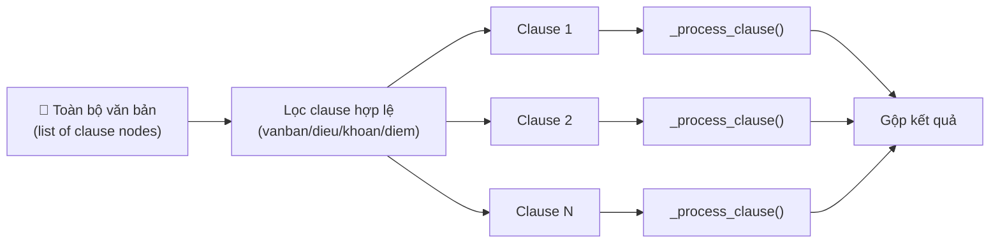
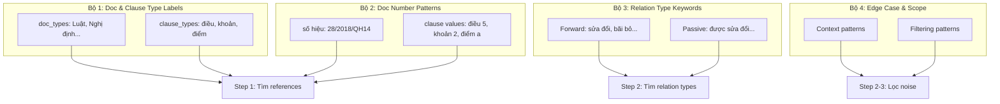
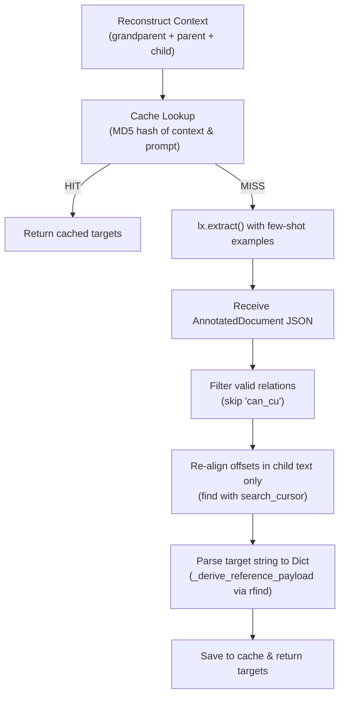

# Phân Tích Hệ Thống Trích Xuất Quan Hệ Pháp Luật

## Lời Nói Đầu: Mục Tiêu Dự Án & Bối Cảnh Thực Tế

### 1. Mục Tiêu Dự Án
Mục tiêu tối thượng của hệ thống là trích xuất chính xác các quan hệ pháp luật (như sửa đổi, bổ sung, bãi bỏ, thay thế, dẫn chiếu...) trên cơ sở dữ liệu thực tế khổng lồ gồm **~600.000 văn bản pháp luật Việt Nam**. 

### 2. Thống Kê Tập Dữ Liệu Đánh Giá Hiện Tại (Exploratory Data Analysis - EDA)
Để đo lường chất lượng, dự án sử dụng bộ dữ liệu chuẩn `golden_eval.csv`. Qua phân tích EDA, cấu trúc của bộ benchmark này cụ thể như sau:
- **Quy mô:** Gồm **1.787 quan hệ pháp luật** được gán nhãn Ground Truth chuẩn xác.
- **Độ đa dạng văn bản:** Phân bổ trên **351 văn bản nguồn độc nhất** (`so_hieu`) với **719 điều khoản độc nhất** (`clause`).
- **Phân bổ theo loại Điều khoản (Clause Type):**
  * Khoản (`khoan`): **585** mẫu
  * Điểm (`diem`): **431** mẫu
  * Văn bản (`vanban`): **414** mẫu
  * Điều (`dieu`): **357** mẫu
- **Phân bổ theo Loại quan hệ (Relation Type - 15 loại):**
  * Dẫn chiếu (`dan_chieu`): **495**
  * Căn cứ (`can_cu`): **299**
  * Sửa đổi (`sua_doi`): **270**
  * Bãi bỏ (`bai_bo`): **221**
  * Sửa đổi bổ sung (`sua_doi_bo_sung`): **123**
  * Thay thế (`thay_the`): **67**
  * Quy định chi tiết (`quy_dinh_chi_tiet`): **58**
  * Đính chính (`dinh_chinh`): **48**
  * Ngưng hiệu lực (`ngung_hieu_luc`): **46**
  * Bổ sung (`bo_sung`): **45**
  * Hợp nhất (`hop_nhat`): **44**
  * Kéo dài hiệu lực (`keo_dai_hieu_luc`): **26**
  * Đình chỉ (`dinh_chi`): **16**
  * Hướng dẫn (`huong_dan`): **15**
  * Hủy bỏ (`huy_bo`): **14**

### 3. Insight Quan Trọng: Khoảng Cách Giữa Benchmark và Thực Tế (Benchmark vs Production Gap)

> [!IMPORTANT]
> **Vấn đề cốt lõi về chất lượng dữ liệu:**
> 1. **Độ chính xác của Ground Truth cực cao:** Tập dữ liệu benchmark hiện tại rất đáng tin cậy vì phần lớn nhãn được gán thủ công và rà soát kỹ bởi các chuyên gia pháp lý. Lỗi sai nhãn (label noise) trong tập này là cực kỳ thấp.
> 2. **Độ phủ thực tế không cao:** Tập benchmark được tổng hợp tích lũy dần theo thời gian qua các case-study cụ thể phát sinh trong quá trình phát triển. Nó không thể đại diện cho toàn bộ sự đa dạng của ~600.000 văn bản thực tế.
> 3. **Văn bản pháp luật cập nhật liên tục:** Văn văn phong, format, cấu trúc ngữ nghĩa của các văn bản pháp luật thay đổi liên tục qua các thời kỳ lịch sử và các cơ quan ban hành khác nhau. 
> 4. **Tối ưu hóa Benchmark chỉ là phần nổi:** Việc cố gắng tinh chỉnh thuật toán để đạt điểm tuyệt đối (F1 = 1.0) trên tập benchmark này có nguy cơ gây Overfitting. Thực tế chạy trên toàn bộ cơ sở dữ liệu lớn cho thấy chất lượng trích xuất thực tế thường thấp hơn nhiều so với điểm benchmark (có sự chênh lệch lớn).
>
> **Định hướng phát triển:** Optimize hệ thống không chỉ là làm hài lòng các chỉ số trên bộ benchmark mà phải tăng cường tính tổng quát hóa (generalization) của cả bộ Regex cứng lẫn mô hình LLM để chống chịu được sự đa dạng văn phong của 600k văn bản thực tế.

---

# Chi Tiết Logic Trích Xuất: Input, Output, và Bộ Regex

## 1. INPUT: Đơn phần tử hay cả văn bản?

### Trong Production (pipeline thật)

Input là **CẢ VĂN BẢN** — danh sách tất cả các clause nodes (điều, khoản, điểm, vanban) đã được parse sẵn:

```python
# RelationsExtractor.extract_relations(data, cls_so_hieu, cls_title, ...)
data = [
    {"com_type": "vanban", "com_key": "vanban_1", "com_title": "LUẬT\nSỬA ĐỔI..."},
    {"com_type": "dieu",   "com_key": "dieu_1",   "com_title": "Điều 1. Sửa đổi..."},
    {"com_type": "khoan",  "com_key": "khoan_1",  "com_title": "1. Sửa đổi khoản 2..."},
    {"com_type": "diem",   "com_key": "diem_a",   "com_title": "a) Thay thế cụm từ..."},
    {"com_type": "dieu",   "com_key": "dieu_2",   "com_title": "Điều 2. Bãi bỏ..."},
    # ... tất cả các node trong văn bản
]
```

**NHƯNG** hệ thống xử lý **TỪNG CLAUSE MỘT** (đơn phần tử):



Cụ thể tại [relations_extractor.py:260-291](file:///c:/Users/minhnn/Documents/cmcai/CAI_Legal/research/src/domain/extractors/relations_extractor.py#L260-L291):

```python
# Lọc clause hợp lệ
eligible = [
    c for c in data
    if c.get("com_type").lower() in {"dieu", "khoan", "diem", "vanban"}
    and ContentExtractor.get_content(c).strip()
]

# Xử lý từng clause (serial hoặc parallel tùy use_llm)
for clause in eligible:
    result = self._process_clause(clause, ...)  # ← XỬ LÝ 1 CLAUSE
    results.extend(result)
```

### Trong Evaluation

Input trực tiếp là **1 clause duy nhất** (1 dòng CSV = 1 clause content):

```
so_hieu: 28/2018/QH14
clause_type: vanban
content: "LUẬT SỬA ĐỔI... Căn cứ Hiến pháp..."
parent_content: ""
grandparent_content: ""
```

### Tại sao cần parent_content và grandparent_content?

Vì khi xử lý 1 clause cấp thấp (điểm/khoản), hệ thống cần **ngữ cảnh từ điều khoản cha** để:
- Tìm tên văn bản được nhắc ở tiêu đề Điều (clause cha)
- Kế thừa relation type từ điều khoản cha (ví dụ: Điều nói "Bãi bỏ:", khoản con liệt kê văn bản)

```
Ví dụ:
  Điều 5 (parent):  "Bãi bỏ toàn bộ 02 Thông tư liên tịch sau đây:"
  Khoản 1 (current): "Thông tư liên tịch số 135/2008/TTLT-BTC-BTNMT..."
                     → Khoản 1 không có keyword "bãi bỏ", nhưng kế thừa từ Điều cha
```

---

## 2. HỆ THỐNG REGEX: 4 BỘ CHÍNH

### Tổng quan kiến trúc



---

### BỘ 1: Doc Type Labels & Clause Type Labels

**Nguồn**: [doc_and_clause_types.yml](file:///c:/Users/minhnn/Documents/cmcai/CAI_Legal/research/src/configs/doc_and_clause_types.yml)

**Mục đích**: Nhận diện **tên loại văn bản** và **tên loại điều khoản** trong text.

| Nhóm | Giá trị | Ví dụ trong text |
|------|---------|------------------|
| **doc_types** (20 loại) | Hiến pháp, Bộ luật, Luật, Pháp lệnh, Nghị quyết, Nghị quyết liên tịch, Quyết định, Nghị định, Thông tư, Thông tư liên tịch, Công văn, Chỉ thị, Công điện, Điều ước quốc tế, Hiệp định, Hướng dẫn, Kế hoạch, Văn bản, Lệnh, Sắc lệnh | `"...theo quy định tại **Nghị định** số 10/2023..."` |
| **clause_types** (3 loại) | điều, khoản, điểm | `"...sửa đổi **khoản** 2 **Điều** 38..."` |

**Cách dùng**: Được ghép thành regex pattern `(?:Hiến pháp|Bộ luật|Luật|...|Sắc lệnh)` để match label trong text, sau đó tìm số hiệu đi kèm.

---

### BỘ 2: Doc Number Patterns (Số hiệu văn bản)

**Nguồn**: [doc_number_patterns.yml](file:///c:/Users/minhnn/Documents/cmcai/CAI_Legal/research/src/configs/doc_number_patterns.yml)

**Mục đích**: Sau khi tìm được label (VD: "Nghị định"), dùng pattern tương ứng để trích xuất **số hiệu cụ thể**.

| Loại VB (key) | Regex patterns | Match ví dụ |
|---|---|---|
| **diem** | `(?<!\w)[a-zđ](?:\.\\d+\|\\d*)\\b` | `a`, `b`, `đ`, `a.1` |
| **khoan** | `\\d+[a-zđ]?` | `1`, `2`, `3a`, `1đ` |
| **dieu** | `\\d+[a-zđ]?` | `5`, `38`, `70a` |
| **luat** | `\\b\\d{2,5}/\\d{4}/QH\\d{1,3}\\b` | `55/2010/QH12`, `28/2018/QH14` |
| | `\\b\\d{1,3}[bB]?-LCT\\b` | `45-LCT` (luật cũ) |
| **boluat** | `\\b\\d{2,5}/\\d{4}/QH\\d{1,3}\\b` | `91/2015/QH13` |
| **nghidinh** | `\\b(?:số\\s+)?\\d{1,5}/\\d{4}/NĐ-CP\\b` | `số 10/2023/NĐ-CP` |
| **thongtu** | `\\b(?:số\\s+)?\\d{1,5}/\\d{4}/TT-[A-ZĐ]{2,8}\\b` | `số 12/2021/TT-BTC` |
| **thongtulientich** | `\\b(?:số\\s+)?\\d{1,5}/\\d{4}/TTLT(?:-[A-ZĐ0-9]+)*\\b` | `135/2008/TTLT-BTC-BTNMT` |
| **quyetdinh** | `\\b\\d{2,5}/\\d{4}/QĐ-[A-ZĐ]{2,10}\\b` | `20/2010/QĐ-UBND` |
| **nghiquyet** | `\\b(?:số\\s*)?\\d{1,4}/\\d{4}/NQ-[A-ZĐ]{2,10}\\b` | `41/2017/NQ-CP` |
| **phaplenh** | `\\b\\d{1,5}/\\d{4}/PL-UBTVQH\\d{1,3}\\b` | `12/2000/PL-UBTVQH10` |
| **chithi** | `\\b(?:số\\s+)?\\d{1,5}/\\d{4}/CT-[A-ZĐ]{1,10}\\b` | `16/2023/CT-TTg` |
| **congvan** | `\\b\\d{2,5}/[A-ZĐ]{1,10}-[A-ZĐ]{1,10}\\b` | `1234/BTP-PLDSKT` |
| **hienphap** | `68-LCT/HĐND8` | (fixed pattern, Hiến pháp 1992) |
| **vanban** (generic) | 30+ patterns covering mọi format số hiệu | fallback catch-all |

> [!NOTE]
> Mỗi loại VB có **nhiều variant regex** vì số hiệu VB Việt Nam có nhiều format khác nhau qua các thời kỳ: `55/2010/QH12` (hiện đại), `45-LCT` (cũ), `110-SL/L.12` (sắc lệnh cổ)...

---

### BỘ 3: Relation Type Keywords (Từ khóa hành động)

**Nguồn**: [relation_type_rules.py](file:///c:/Users/minhnn/Documents/cmcai/CAI_Legal/research/src/domain/extractors/relation_type_rules.py)

**Mục đích**: Tìm **từ khóa chỉ loại quan hệ** trong text.

#### A. Forward Patterns (chủ động — 10 loại, ~60 patterns)

| Relation type | Regex patterns (chọn lọc) | Match text ví dụ |
|---|---|---|
| **sua_doi_bo_sung** | `sửa\s+đổi\s*,\s*bổ\s+sung` | "**Sửa đổi, bổ sung** khoản 2..." |
| | `sửa\s+đổi` | "**Sửa đổi** Điều 38..." |
| | `bổ\s+sung` | "**Bổ sung** điểm c..." |
| | `bãi\s+bỏ\s+cụm\s+từ` | "**Bãi bỏ cụm từ** 'và đơn vị'..." |
| | `thay\s+(?:các\s+)?cụm\s+từ` | "**Thay cụm từ** 'quản lý'..." |
| | `bãi\s+bỏ\s+một\s+phần` | "**Bãi bỏ một phần** Nghị định..." |
| | `điều\s+chỉnh(?=\s+doc_clause_type)` | "**Điều chỉnh** Nghị định..." |
| **thay_the** | `thay\s+thế` | "**Thay thế** Quyết định..." |
| **bai_bo** | `bãi\s+bỏ\s+toàn\s+bộ` | "**Bãi bỏ toàn bộ** Thông tư..." |
| | `bãi\s+bỏ` | "**Bãi bỏ** Điều 5..." |
| | `chấm\s+dứt\s+hiệu\s+lực` | "**Chấm dứt hiệu lực** QĐ..." |
| **huy_bo** | `hủy\s+bỏ` | "**Hủy bỏ** Quyết định..." |
| **dinh_chinh** | `đính\s+chính` | "**Đính chính** lỗi kỹ thuật..." |
| | `sửa\s+cụm\s+từ` | "**Sửa cụm từ** 'UBND'..." |
| **dinh_chi** | `đình\s+chỉ\s+hiệu\s+lực\s+thi\s+hành` | "**Đình chỉ hiệu lực thi hành**..." |
| | `đình\s+chỉ\s+việc\s+thi\s+hành` | "**Đình chỉ việc thi hành**..." |
| **ngung_hieu_luc** | `ngưng\s+hiệu\s+lực` | "**Ngưng hiệu lực** thi hành..." |
| **keo_dai_hieu_luc** | `kéo\s+dài\s+hiệu\s+lực` | "**Kéo dài hiệu lực** Nghị quyết..." |
| | `kéo\s+dài\s+thời\s+gian` | "**Kéo dài thời gian** áp dụng..." |
| **quy_dinh_chi_tiet** | `quy\s+định\s+chi\s+tiết` | "**Quy định chi tiết** Luật..." |
| **huong_dan** | `hướng\s+dẫn\s+thi\s+hành` | "**Hướng dẫn thi hành** Luật..." |
| | `hướng\s+dẫn\s+thực\s+hiện` | "**Hướng dẫn thực hiện** NĐ..." |
| **dan_chieu** | `theo\s+quy\s+định\s+tại\s+<doc_type>` | "**theo quy định tại Nghị định**..." |
| | `quy\s+định\s+tại\s+<doc_type>` | "**quy định tại Luật**..." |
| | `được\s+quy\s+định\s+tại\s+<doc_type>` | "**được quy định tại Thông tư**..." |
| | `tại\s+<doc_type>` | "**tại Quyết định** số..." |
| | `theo\s+<doc_type>` | "**theo Nghị định** số..." |

> [!IMPORTANT]
> Patterns `dan_chieu` sử dụng `<doc_type>` (ví dụ `(?:Luật|Nghị định|Thông tư|...)`) — do đó chúng phụ thuộc vào config YAML và được build lazily lần đầu tiên.

#### B. Passive Patterns (bị động — 1 loại, 3 patterns)

| Relation type | Regex | Match text ví dụ |
|---|---|---|
| **sua_doi_bo_sung** | `được\s+sửa\s+đổi\s*,\s*bổ\s+sung` | "Luật X **được sửa đổi, bổ sung** bởi Luật Y" |
| | `được\s+sửa\s+đổi` | "Điều 5 **được sửa đổi** theo NĐ..." |
| | `được\s+bổ\s+sung` | "khoản 2 **được bổ sung** bởi..." |

---

### BỘ 4: Edge Case, Scope & Context Patterns (~30+ patterns)

**Mục đích**: Xử lý các trường hợp đặc biệt, lọc noise, phân biệt mơ hồ.

| Pattern | File | Mục đích |
|---|---|---|
| `SEGMENT_DELIMITER_PATTERN` | [relation_type_rules.py:23](file:///c:/Users/minhnn/Documents/cmcai/CAI_Legal/research/src/domain/extractors/relation_type_rules.py#L23) | Phân tách câu thành segments bằng `,` `.` `;` `và` `hoặc` |
| `SCOPE_DELIMITERS` | [relation_type_rules.py:25](file:///c:/Users/minhnn/Documents/cmcai/CAI_Legal/research/src/domain/extractors/relation_type_rules.py#L25) | Ranh giới hard scope: `.` `;` `\n` |
| `BAI_BO_EDGE_CASE` | [relation_type_rules.py:31-33](file:///c:/Users/minhnn/Documents/cmcai/CAI_Legal/research/src/domain/extractors/relation_type_rules.py#L31-L33) | "hết hiệu lực thi hành từ ngày" → `thay_the` (không phải `bai_bo`) |
| `DAN_CHIEU_EXCLUSIONS` | [relation_type_rules.py:169-171](file:///c:/Users/minhnn/Documents/cmcai/CAI_Legal/research/src/domain/extractors/relation_type_rules.py#L169-L171) | Lọc "ban hành kèm theo" khỏi `dan_chieu` khi có relation mạnh hơn |
| `AMENDMENT_PROVENANCE` | [reference_extraction.py:36-38](file:///c:/Users/minhnn/Documents/cmcai/CAI_Legal/research/src/domain/extractors/base_extractor_flow/reference_extraction.py#L36-L38) | Mask "(được sửa đổi bởi NĐ X)" — chú thích lịch sử, không phải target |
| `FORM_IDENTIFIER_PREFIX` | [reference_extraction.py:47-49](file:///c:/Users/minhnn/Documents/cmcai/CAI_Legal/research/src/domain/extractors/base_extractor_flow/reference_extraction.py#L47-L49) | Lọc "Mẫu số 29-TTr" — mã biểu mẫu, không phải số hiệu VB |
| `_DOC_TYPE_NAY_PATTERN` | [reference_extraction.py:23-26](file:///c:/Users/minhnn/Documents/cmcai/CAI_Legal/research/src/domain/extractors/base_extractor_flow/reference_extraction.py#L23-L26) | Phát hiện "Luật này", "Thông tư này" → internal self-reference |
| `_THUC_HIEN_THEO_QUY_DINH_TAI` | [relation_type_extraction.py:60-63](file:///c:/Users/minhnn/Documents/cmcai/CAI_Legal/research/src/domain/extractors/base_extractor_flow/relation_type_extraction.py#L60-L63) | "Việc sửa đổi **thực hiện theo quy định tại** NĐ X" → `dan_chieu` (VB này không sửa đổi, chỉ dẫn chiếu) |
| `_CITATION_CUE_PREFIX` | [relation_type_extraction.py:69-78](file:///c:/Users/minhnn/Documents/cmcai/CAI_Legal/research/src/domain/extractors/base_extractor_flow/relation_type_extraction.py#L69-L78) | "theo đúng quy định tại/của" → convert action → `dan_chieu` |
| `_CONTINUE_IMPLEMENT` | [relation_type_extraction.py:100-103](file:///c:/Users/minhnn/Documents/cmcai/CAI_Legal/research/src/domain/extractors/base_extractor_flow/relation_type_extraction.py#L100-L103) | "tiếp tục thực hiện theo quy định của" → `dan_chieu` |
| `_CONTENT_EXPIRY_SDBS` | [relation_type_extraction.py:50-55](file:///c:/Users/minhnn/Documents/cmcai/CAI_Legal/research/src/domain/extractors/base_extractor_flow/relation_type_extraction.py#L50-L55) | "thủ tục hành chính...hết hiệu lực" → `sua_doi_bo_sung` (partial) |
| `_ATTACHED_MATERIAL_ACTION` | [relation_type_extraction.py:115-120](file:///c:/Users/minhnn/Documents/cmcai/CAI_Legal/research/src/domain/extractors/base_extractor_flow/relation_type_extraction.py#L115-L120) | "bãi bỏ các phụ lục...kèm theo" → `dan_chieu` hoặc `sua_doi_bo_sung` |
| `LEADING_AMENDMENT_TARGET_INTRO` | [reference_extraction.py:109-113](file:///c:/Users/minhnn/Documents/cmcai/CAI_Legal/research/src/domain/extractors/base_extractor_flow/reference_extraction.py#L109-L113) | "sửa đổi...như sau:" → chỉ lấy targets trước "như sau:" |
| `BARE_CONJOINED_NUMBERED_REF` | [reference_extraction.py:57-61](file:///c:/Users/minhnn/Documents/cmcai/CAI_Legal/research/src/domain/extractors/base_extractor_flow/reference_extraction.py#L57-L61) | "Luật X **và số** Y" → liên kết thêm VB thứ 2 |

---

## 3. TỔNG KẾT: FLOW ĐẦY ĐỦ VỚI REGEX

```
INPUT: 1 clause text (ví dụ nội dung Điều 1)
│
├─ BỘ 1+2 (Reference Extraction):
│   ├─ Scan text với doc_types labels → tìm "Nghị định", "Luật", "Thông tư"...
│   ├─ Dùng doc_number_patterns tương ứng → trích "số 10/2023/NĐ-CP"
│   ├─ Scan text với clause_types labels → tìm "khoản", "Điều", "điểm"
│   ├─ Dùng clause value patterns → trích "khoản 2", "Điều 38", "điểm a"
│   ├─ Group clause components → {diem: "a", khoan: "2", dieu: "38", nghidinh: "10/2023/NĐ-CP"}
│   └─ OUTPUT: List[Reference] (mỗi reference = 1 dict với vị trí + thông tin)
│
├─ BỘ 3 (Relation Type Extraction):
│   ├─ Scan text với forward_patterns → tìm "sửa đổi, bổ sung", "bãi bỏ"...
│   ├─ Scan text với passive_patterns → tìm "được sửa đổi"...
│   ├─ Ghi nhận vị trí (position_start, position_end) của mỗi keyword
│   └─ OUTPUT: List[RelationType] (mỗi item = {type, position})
│
├─ BỘ 4 (Edge Case Filtering):
│   ├─ Lọc "Mẫu số X" (biểu mẫu, không phải VB)
│   ├─ Lọc "(được sửa đổi bởi NĐ X)" (chú thích lịch sử)  
│   ├─ Convert "thực hiện theo quy định tại" → dan_chieu
│   ├─ Phát hiện "Luật này" → internal reference
│   └─ Xử lý scope/delimiter/conflict
│
├─ MATCHING (Relation ↔ Reference):
│   ├─ Ghép keyword + reference dựa trên vị trí gần nhau
│   └─ OUTPUT: List[{relation_type, reference}]
│
└─ OUTPUT: Grouped relations cho clause này
```

## 4. SỐ LƯỢNG REGEX TỔNG CỘNG

| Bộ | Số lượng | Nguồn |
|---|---|---|
| Bộ 1: Doc type labels | 20 labels | `doc_and_clause_types.yml` |
| Bộ 1: Clause type labels | 3 labels | `doc_and_clause_types.yml` |
| Bộ 2: Doc number patterns | ~100+ regex patterns | `doc_number_patterns.yml` |
| Bộ 3: Forward relation patterns | ~60 regex patterns (10 relation types) | `relation_type_rules.py` |
| Bộ 3: Passive relation patterns | 3 regex patterns (1 relation type) | `relation_type_rules.py` |
| Bộ 4: Edge case/scope/context | ~30+ regex patterns | `reference_extraction.py`, `relation_type_extraction.py`, `relation_type_edge_cases.py` |
| **Tổng** | **~200+ regex patterns** | |

> [!IMPORTANT]
> Con số ~200+ regex chỉ tính các pattern chính. Trong thực tế, nhiều pattern được build **dynamically** bằng cách ghép doc_types/clause_types vào template (ví dụ: `r"tại\s+(?:Luật|Nghị định|...)"` được build từ 20 doc_types).

---

## 5. LLM Fallback (Mô hình ngôn ngữ bổ trợ)

Hệ thống sử dụng bộ bóc tách dựa trên luật (regex) làm cốt lõi để đảm bảo tốc độ và độ chính xác cao. Tuy nhiên, khi gặp các câu có cấu trúc ngôn ngữ phức tạp, không theo mẫu chung hoặc mơ hồ về ngữ nghĩa, hệ thống sẽ kích hoạt LLM làm cơ chế cứu trợ (Fallback).

### A. Chi tiết các tham số đầu vào của hàm Trigger
Hàm kiểm tra kích hoạt LLM được định nghĩa như sau:
```python
def _evaluate_llm_trigger(
    self,
    relation_types: List[Dict],
    relation_matches: List[Dict],
    references: List[Dict],
) -> bool:
```
*   `relation_types`: Danh sách các loại quan hệ được phát hiện qua từ khóa trong clause (ví dụ: `[{"relation_type": "dan_chieu", "position_start": 44, "position_end": 50}]`).
*   `relation_matches`: Danh sách các quan hệ đã được luật cứng (Regex Matcher) ghép nối thành công giữa **từ khóa quan hệ** và **số hiệu văn bản mục tiêu** (ví dụ: `[{"relation_type": "thay_the", "reference": {"luat": "..."}}]`).
*   `references`: Danh sách tất cả các thực thể văn bản mục tiêu bóc tách được từ text (qua Bộ 1 + Bộ 2) (ví dụ: `[{"luat": {"information": "Luật Tiếp cận thông tin số 104/2016/QH13"}}]`).

---

### B. Cơ chế kích hoạt 5 điều kiện (C1, C3, C4a, C4b, C5)

LLM chỉ được gọi khi chế độ `--use-llm` được bật, có ít nhất một từ khóa quan hệ thuộc diện được hỗ trợ (`has_eligible_type` = True) và thỏa mãn một trong các điều kiện logic dưới đây:

#### **1. Điều kiện C1: Có hành động nhưng không khớp được mục tiêu**
*   **Mã nguồn:**
    ```python
    if has_eligible_type and not relation_matches:
        return True
    ```
*   **Ý nghĩa:** Regex quét được từ khóa hành động hợp lệ (như *"thay thế"*, *"sửa đổi"*), nhưng Regex Matcher hoàn toàn **thất bại** trong việc ghép cặp từ khóa này với bất kỳ văn bản mục tiêu nào trong câu.
*   **Ví dụ thực tế:** *"Quyết định này ban hành Quy chế bảo vệ bí mật nhà nước. Các văn bản trước đây trái với Quyết định này đều bãi bỏ."* 
    *   *Tại sao Regex thất bại:* Từ khóa *"bãi bỏ"* nằm ở cuối câu, cách xa mục tiêu *"Các văn bản trước đây"* (vốn là một tham chiếu chung mơ hồ không có số hiệu cụ thể nằm ở đầu câu), khiến luật vị trí (distance-based rules) của Regex không thể tự động ghép cặp.
*   **Mục tiêu kích hoạt:** Gọi LLM để phân tích cú pháp câu lắt léo và tìm mục tiêu ẩn hoặc tham chiếu chung.

#### **2. Điều kiện C3: Quá nhiều mục tiêu bị bỏ sót**
*   **Mã nguồn:**
    ```python
    if has_eligible_type and relation_matches:
        if len(references or []) - len(relation_matches or []) >= 2:
            return True
    ```
*   **Ý nghĩa:** Luật cứng đã ghép cặp thành công một số quan hệ. Tuy nhiên, số lượng thực thể số hiệu văn bản bóc được (`references`) trừ đi số lượng quan hệ đã ghép cặp thành công (`relation_matches`) vẫn còn **dư thừa từ 2 thực thể trở lên** (tức là có ít nhất 2 văn bản bị "bỏ rơi").
*   **Ví dụ thực tế:** *"Sửa đổi, bổ sung Điều 5 Nghị định số 10/2023/NĐ-CP; bãi bỏ Nghị định số 12/2021/NĐ-CP và Quyết định số 20/2010/QĐ-UBND."*
    *   *Tại sao Regex thất bại:* Regex Matcher có thể chỉ ghép thành công cặp `(sua_doi_bo_sung, Nghị định 10/2023)` và cặp `(bai_bo, Nghị định 12/2021)`, nhưng bỏ sót `Quyết định 20/2010` do khoảng cách ký tự vượt quá ngưỡng tối đa hoặc dấu phân cách câu phân mảnh.
*   **Mục tiêu kích hoạt:** LLM sẽ rà soát lại toàn bộ câu để ghép nốt các thực thể bị bỏ sót vào đúng quan hệ hành động của chúng.

#### **3. Điều kiện C4a: Đồng xuất hiện các quan hệ hướng dẫn & quy định chi tiết**
*   **Mã nguồn:**
    ```python
    if len(detected_types & {"quy_dinh_chi_tiet", "huong_dan"}) >= 2:
        return True
    ```
*   **Ý nghĩa:** Trong cùng một điều khoản xuất hiện các từ khóa liên quan đến cả hai loại quan hệ `quy_dinh_chi_tiet` (quy định chi tiết) và `huong_dan` (hướng dẫn).
*   **Ví dụ thực tế:** *"Thông tư này quy định chi tiết Điều 3 và hướng dẫn thi hành khoản 2 Điều 10 của Luật X."*
    *   *Tại sao Regex thất bại:* Regex Matcher dễ bị ghép nhầm chéo: ghép cả hai hành động `quy_dinh_chi_tiet` và `huong_dan` vào cả hai mục tiêu `Điều 3` và `khoản 2 Điều 10`.
*   **Mục tiêu kích hoạt:** Nhờ LLM phân định chính xác văn bản nào thuộc diện quy định chi tiết, văn bản nào thuộc diện hướng dẫn để gán nhãn chính xác.

#### **4. Điều kiện C4b: Nhập nhằng dẫn chiếu và hành động mạnh**
*   **Mã nguồn:**
    ```python
    if "dan_chieu" in detected_types and detected_types & self._MAJOR_RELATION_TYPES:
        return True
    ```
*   **Ý nghĩa:** Trong câu vừa chứa từ khóa dẫn chiếu thông thường (`dan_chieu` - e.g. *"quy định tại"*, *"theo quy định"*) vừa chứa từ khóa của các quan hệ sửa đổi/bãi bỏ/thay thế (`_MAJOR_RELATION_TYPES`).
*   **Ví dụ thực tế:** *"Việc bãi bỏ các thủ tục hành chính tại Điều 5 được thực hiện theo quy định tại Nghị định số 10/2023/NĐ-CP."*
    *   *Tại sao Regex thất bại:* Regex dễ bắt nhầm từ khóa hành động mạnh `"bãi bỏ"` và ghép nó với mục tiêu `"Nghị định 10/2023"` (tạo ra quan hệ `bai_bo` sai), trong khi thực chất Nghị định 10/2023 chỉ là văn bản được dẫn chiếu (`dan_chieu`) để hướng dẫn thủ tục.
*   **Mục tiêu kích hoạt:** LLM sẽ xác định hành động chính thực sự của câu để tránh ghép sai loại quan hệ.

#### **5. Điều kiện C5: Thiếu thông tin văn bản gốc**
*   **Mã nguồn:**
    ```python
    for match in relation_matches or []:
        reference = match.get("reference") or {}
        has_external_document = any(
            key not in SEARCHABLE_CLAUSE_TYPE_SET # SEARCHABLE_CLAUSE_TYPE_SET = {"dieu", "khoan", "diem"}
            for key, value in reference.items()
            if isinstance(value, dict)
        )
        if not has_external_document:
            return True
    ```
*   **Ý nghĩa:** Có bất kỳ quan hệ nào đã bóc được mà thực thể mục tiêu (`reference`) chỉ chứa thông tin điều khoản con (`dieu`, `khoan`, `diem`) nhưng **hoàn toàn không chứa bất kỳ thông tin nào về văn bản ngoài** (như số hiệu Luật, Nghị định...).
*   **Ví dụ thực tế:** *"Sửa đổi điểm a khoản 1 Điều này."* hoặc *"Bãi bỏ khoản 2 Điều 15."* (không ghi rõ của văn bản nào).
*   **Mục tiêu kích hoạt:** Khi mục tiêu không có tên văn bản đi kèm, cần khôi phục ngữ cảnh (context recovery) từ tiêu đề hoặc điều khoản cha/ông. LLM có khả năng suy luận ngữ cảnh rất tốt để điền văn bản bị thiếu này.


---

### C. Phân tích nguyên nhân sụt giảm F1 khi bật LLM (Drop Performance)

Dựa trên kết quả chạy đánh giá thực tế trên bộ dữ liệu `golden_eval.csv`:
*   **Không dùng LLM (Rules-only):** `P = 0.891`, `R = 0.904`, `F1 = 0.897` (TP=1615, FP=197, FN=172)
*   **Có dùng LLM (Rules + LLM):** `P = 0.866`, `R = 0.909`, `F1 = 0.887` (TP=1624, FP=251, FN=163)

#### **1. Recall chỉ tăng nhẹ (R: 0.904 → 0.909):**
LLM chỉ cứu thêm được đúng **9 quan hệ chính xác** (TP tăng từ 1615 lên 1624). Điều này chứng tỏ bộ luật Regex cơ bản đã bao phủ rất tốt hầu hết các cấu trúc câu dẫn chiếu chuẩn mực của pháp luật Việt Nam. Những case khó mà LLM cứu được chiếm tỷ lệ rất nhỏ.

#### **2. Precision sụt giảm nghiêm trọng (P: 0.891 → 0.866, sinh thêm 54 lỗi sai - FP tăng từ 197 lên 251):**
*   **Nhiễu ngữ cảnh do gộp chuỗi (Context Noise):** Khi gọi LLM, hệ thống gộp `grandparent_content + parent_content + content` làm đầu vào. Khi đó, LLM nhìn thấy toàn bộ văn bản và có xu hướng bóc tách **tất cả** các số hiệu văn bản xuất hiện trong đoạn ngữ cảnh đó (bao gồm các văn bản chỉ mang tính chất giới thiệu lịch sử sửa đổi, văn bản dẫn chứng quy trình phụ). Việc bóc tách quá đà này tạo ra các quan hệ ảo không có hiệu lực thi hành thực tế.
*   **Mất bộ lọc nhiễu cứng (Loss of Edge Case Filters):** Các bộ lọc nhiễu ở Bộ 4 (ví dụ loại bỏ "Mẫu số X", loại bỏ chú thích lịch sử trong ngoặc đơn) chỉ được cài đặt cứng cho luồng Regex. Khi dữ liệu đi vào LLM, mô hình không có các ràng buộc này và dễ dàng bóc sai các thông tin nhiễu đó thành quan hệ chính thức.
*   **Lệch nhãn quan hệ (Label Mismatch):** LLM đôi khi hiểu sai hoặc phân loại nhầm giữa các nhãn quan hệ gần nghĩa (ví dụ nhãn `bai_bo` bị bóc thành `thay_the`, hoặc `dan_chieu` thành `quy_dinh_chi_tiet`), tạo ra các False Positives trong việc gán nhãn quan hệ.
*   **Lỗi cú pháp đầu ra (Format Errors):** Các cảnh báo `Skipping chunk: parse error` cho thấy mô hình sinh từ không tuân thủ hoàn hảo định dạng JSON Schema yêu cầu, dẫn đến việc bị mất thông tin hoặc bóc tách sai lệch vị trí ký tự.

---

### D. Cách thức hoạt động và Quy trình xử lý của `LangExtractRelationFallback`

Không chỉ dừng lại ở Prompt, cơ chế LLM Fallback hoạt động như một pipeline lập trình chặt chẽ kết hợp giữa Few-shot Prompting, Gọi API cấu trúc, Tái định vị vị trí ký tự (Span Alignment), và Phân giải cú pháp Python:



#### **Bước 1: Tiền xử lý dữ liệu mẫu Few-shot (Few-shot Initialization)**
*   Thư viện `langextract` hoạt động dựa trên các ví dụ mẫu (few-shot) định nghĩa ở file [examples.py](file:///c:/Users/minhnn/Documents/cmcai/CAI_Legal/research/src/domain/llms/examples.py).
*   Tại thời điểm import module, hàm `_convert_examples_to_relation_match_schema()` tự động chuyển đổi các ví dụ thô thành định dạng `RELATION_MATCH` có cấu trúc thông qua hàm hỗ trợ `_derive_reference_payload()`. Việc này đảm bảo LLM luôn được học trên các dữ liệu mẫu đã được định hình chuẩn hóa 100%.

#### **Bước 2: Gọi API cấu trúc qua LangExtract**
*   Khi có yêu cầu Fallback, hệ thống kiểm tra cache đĩa cục bộ qua mã băm MD5 của ngữ cảnh và prompt. Nếu cache miss, hệ thống chuẩn bị các tham số gọi:
    ```python
    extract_kwargs = {
        "text_or_documents": content,        # Ngữ cảnh gộp cha/ông/con
        "prompt_description": langextract_prompt, # Prompt CoT hướng dẫn nghiêm ngặt
        "examples": langextract_examples,   # Mẫu few-shot cấu trúc chuẩn
    }
    ```
*   Nếu cấu hình có `LEGAL_LLM_BASE_URL` (ví dụ: `10.4.0.82:8106`), hệ thống sẽ khởi tạo một `ModelConfig` chỉ định `provider="openai"` cùng với API key và Base URL để hướng luồng API của thư viện về local server.
*   Gọi hàm `lx.extract(**extract_kwargs)` để yêu cầu mô hình sinh văn bản. Thư viện ép mô hình phải trả về đúng cấu trúc JSON chứa mảng `"extractions"`.

#### **Bước 3: Lọc nhãn và Tái định vị vị trí ký tự (Span Alignment)**
*   Sau khi nhận được JSON kết quả từ LLM, Python wrapper thực hiện:
    *   **Lọc nhãn:** Kiểm tra `attributes.type`. Nếu nhãn là `can_cu` hoặc nằm ngoài danh sách cho phép, nó sẽ bỏ qua (skip).
    *   **Tái lập tọa độ ký tự:** Do LLM trả về vị trí bắt đầu/kết thúc dựa trên **ngữ cảnh gộp** (gồm cả tiêu đề cha/ông), nếu dùng trực tiếp tọa độ này sẽ bị lệch vị trí của clause con. Python sửa lỗi này bằng cách tìm kiếm lại chuỗi thực thể bóc được (`extraction_text`) trực tiếp trên văn bản gốc của clause con (`position_anchor`) sử dụng hàm `find` kết hợp với một con trỏ dịch chuyển `search_cursor`:
        ```python
        pos_start = position_anchor.find(extraction_text, search_cursor)
        ```
        Việc này giúp tọa độ dự đoán của LLM khớp hoàn hảo với hệ quy chiếu ký tự của câu hiện tại.

#### **Bước 4: Phân giải cấu trúc thực thể mục tiêu (`_derive_reference_payload`)**
*   LLM trả về mục tiêu dưới dạng chuỗi thô (ví dụ: `target = "điểm b khoản 2 Điều 69 Luật Công chứng"`). Để hàm eval so khớp được, chuỗi này phải được phân tách thành cấu trúc dict.
*   Hàm `_derive_reference_payload()` sử dụng Regex để tìm loại văn bản trong mục tiêu (ví dụ: tìm thấy keyword `"luat"`, bóc được `"Luật Công chứng"`).
*   **Chiến thuật tìm kiếm ngược (Reverse Search):** Đối với các thành phần điều khoản con (`điểm b`, `khoản 2`), vì tiếng Việt thường viết điều khoản con ở trước tên luật cha, hệ thống sử dụng hàm `.rfind()` để tìm kiếm ngược các thành phần này từ vị trí xuất hiện của tên luật trở về trước:
    ```python
    found_pos = context_text.rfind(clause_information, 0, doc_pos_in_context)
    ```
*   Kết quả cuối cùng được đóng gói thành một cấu trúc payload đồng nhất với kết quả của bộ Regex (chứa `reference` với các sub-node `luat`, `dieu`, `khoan`, `diem` đầy đủ tọa độ) trước khi đưa vào đối sánh chất lượng.


---

## 6. Phân giải tham chiếu nội bộ & Đảo chiều quan hệ

### A. Phân giải tham chiếu nội bộ (Internal Reference Resolution)

Các điều khoản pháp luật thường sử dụng các cụm từ tham chiếu nội bộ như *"Điều này"*, *"khoản này"*, hoặc *"Luật này"*. Hệ thống sử dụng class `InternalReferenceResolver` để:
*   **Tham chiếu tự thân (Self-reference):** Giải quyết `"Luật này"`, `"Nghị định này"` thành số hiệu cụ thể của chính văn bản hiện tại (`cls_so_hieu`).
*   **Tham chiếu cha-con (Hierarchy resolution):** Giải quyết cụm từ `"Điều này"` trong khoản con thành số hiệu cụ thể của Điều cha dựa trên cây phân cấp `child_to_parent` được xây dựng từ trước.

### B. Đảo chiều quan hệ (Relation Reversal)

Trong cơ sở dữ liệu đồ thị Neo4j, mối quan hệ được định nghĩa theo chiều đi từ **Văn bản mới (chủ thể hành động)** tới **Văn bản cũ (đối tượng chịu tác động)**.
*   **Ví dụ:** Văn bản A thay thế văn bản B. 
    *   Trong văn bản A ghi: *"Văn bản B hết hiệu lực và được thay thế bởi văn bản này."* (Bị động)
    *   Hoặc: *"Văn bản này thay thế văn bản B."* (Chủ động)
*   **Cơ chế đảo chiều:** Hệ thống sử dụng bảng ánh xạ `REVERSED_RELATIONS` để đảo chiều `head` và `tail` đối với các quan hệ bị động hoặc các quan hệ có chiều tự nhiên ngược với quy ước đồ thị, đảm bảo hướng mũi tên trên đồ thị Neo4j luôn thống nhất (ví dụ: `Mới -[thay_the]-> Cũ`).

---

## 7. Các yếu tố ảnh hưởng trực tiếp đến điểm số Đánh giá (Evaluate Metrics)

Khi chạy đánh giá qua tệp `evaluate.py`, chất lượng bóc tách được tính toán trên sự so khớp trực tiếp giữa các dự đoán phẳng (`flat_evaluation_predictions`) và nhãn thực tế (`ground_truth`).

1. **Bộ quy tắc Regex (Reference & Relation Type Extraction):**
   * Quyết định việc nhận diện các cụm thực thể số hiệu và từ khóa quan hệ. Nếu regex bị bắt trượt hoặc bắt nhầm (ví dụ: bóc sai số hiệu hoặc ghép sai cặp quan hệ), điểm số sẽ bị ảnh hưởng trực tiếp (tạo ra False Positives hoặc False Negatives).
2. **Cơ chế LLM Fallback:**
   * Khi Regex bị bất định và kích hoạt LLM, nếu mô hình bóc trúng thêm mục tiêu sẽ tăng Recall (giảm FN), nhưng nếu mô hình "ảo tưởng" (hallucinate) hoặc bóc sai cấu trúc sẽ tạo ra nhiều quan hệ sai, làm giảm Precision (tăng FP).
3. **Phân giải tham chiếu nội bộ (`InternalReferenceResolver`):**
   * Các tham chiếu như *"Điều này"*, *"Luật này"* bắt buộc phải giải quyết thành công vì nhãn trong tập dữ liệu `golden_eval.csv` được ghi nhận dưới dạng chuỗi tên đầy đủ (ví dụ: `Luật Tiếp cận thông tin số 104/2016/QH13`). Nếu phân giải sai hoặc không thể phân giải, chuỗi so sánh sẽ bị lệch và bị tính là dự đoán sai.
4. **Lọc nhiễu và Edge Cases (Bộ 4):**
   * Lọc bỏ biểu mẫu ("Mẫu số X") hoặc các ghi chú lịch sử để tránh sinh ra FP.


