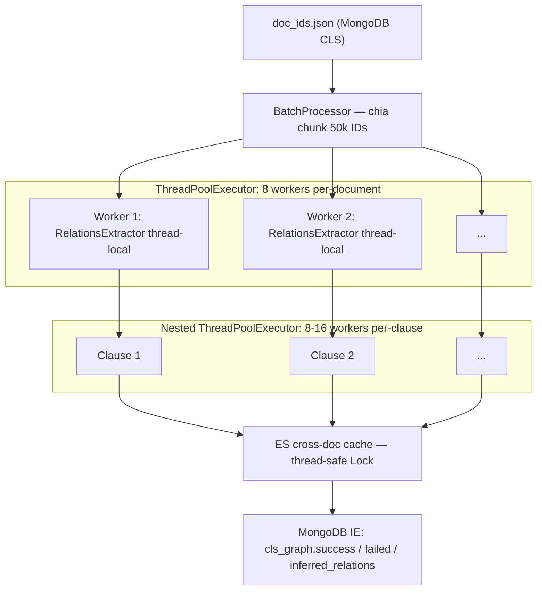
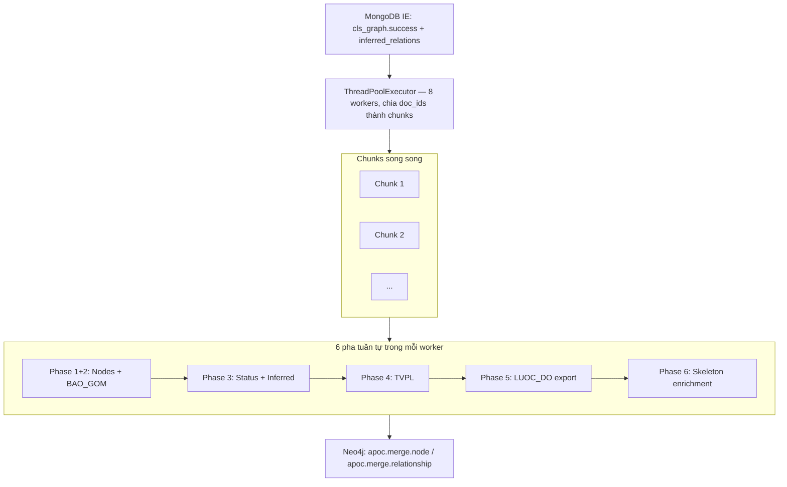
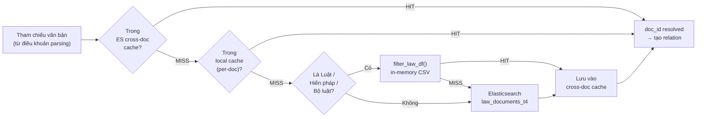

# Báo cáo hiệu năng

**Phiên bản:** 2.1.0  
**Ngày cập nhật:** 2026-06-15  
**Phạm vi:** Tài liệu nội bộ.

---

## Mục lục

- [Báo cáo hiệu năng](#báo-cáo-hiệu-năng)
  - [Mục lục](#mục-lục)
  - [Tóm tắt mở đầu](#tóm-tắt-mở-đầu)
  - [1. Tổng quan kiến trúc hiệu năng](#1-tổng-quan-kiến-trúc-hiệu-năng)
    - [1.1. Hai pha pipeline (tuần tự)](#11-hai-pha-pipeline-tuần-tự)
    - [1.2. Mô hình song song hóa](#12-mô-hình-song-song-hóa)
    - [1.3. Bảng cấu hình mặc định](#13-bảng-cấu-hình-mặc-định)
  - [2. Kết quả benchmark thực tế](#2-kết-quả-benchmark-thực-tế)
    - [2.1. Benchmark v1 — 100 văn bản, 10 lần chạy (baseline gốc 2026-05-13)](#21-benchmark-v1--100-văn-bản-10-lần-chạy-baseline-gốc-2026-05-13)
      - [Kết quả từng lần chạy](#kết-quả-từng-lần-chạy)
      - [Thống kê tổng hợp](#thống-kê-tổng-hợp)
      - [Mức tiêu thụ tài nguyên hệ thống](#mức-tiêu-thụ-tài-nguyên-hệ-thống)
    - [2.2. Benchmark v6 — Matched-window: Baseline vs Optimised (2026-05-27)](#22-benchmark-v6--matched-window-baseline-vs-optimised-2026-05-27)

  - [3. Cơ chế tối ưu hóa](#3-cơ-chế-tối-ưu-hóa)
    - [Phân tích bottleneck trước tối ưu (T0)](#phân-tích-bottleneck-trước-tối-ưu-t0)
    - [3.1. Caching đa tầng](#31-caching-đa-tầng)
    - [3.2. Bulk operations](#32-bulk-operations)
    - [3.3. Thread-local extractor instances](#33-thread-local-extractor-instances)
    - [3.4. In-memory law\_dataframe (CSV fast-path)](#34-in-memory-law_dataframe-csv-fast-path)
    - [3.5. In-process Phase execution — loại bỏ subprocess overhead (T2b, v2)](#35-in-process-phase-execution--loại-bỏ-subprocess-overhead-t2b-v2)
    - [3.6. Serialise clause processing khi không dùng LLM (T2d, v2)](#36-serialise-clause-processing-khi-không-dùng-llm-t2d-v2)
    - [3.7. Gộp 2 ES query thành 1 round-trip với `_msearch` (T2e, v2)](#37-gộp-2-es-query-thành-1-round-trip-với-_msearch-t2e-v2)
    - [3.8. ES connection pool khớp với executor parallelism (T2f, v2)](#38-es-connection-pool-khớp-với-executor-parallelism-t2f-v2)
    - [3.9. Tái sử dụng ThreadPoolExecutor ở instance scope (T1b, v2)](#39-tái-sử-dụng-threadpoolexecutor-ở-instance-scope-t1b-v2)
  - [4. Khả năng phục hồi (Resilience)](#4-khả-năng-phục-hồi-resilience)
    - [4.1. Checkpoint / Resume](#41-checkpoint--resume)
    - [4.2. Retry + Exponential Backoff](#42-retry--exponential-backoff)
  - [5. Ràng buộc hiệu năng](#5-ràng-buộc-hiệu-năng)
    - [5.1. Phase 1 và Phase 2 phải tuần tự](#51-phase-1-và-phase-2-phải-tuần-tự)
    - [5.2. Checkpoint bị tắt khi `--parallel-workers > 1`](#52-checkpoint-bị-tắt-khi---parallel-workers--1)
    - [5.3. MongoDB `$in` threshold 50.000 ID](#53-mongodb-in-threshold-50000-id)
    - [5.4. Skeleton enrichment chỉ xử lý node thiếu](#54-skeleton-enrichment-chỉ-xử-lý-node-thiếu)
  - [6. Diagram — Luồng song song hóa](#6-diagram--luồng-song-song-hóa)
    - [Diagram A — Kiến trúc song song Phase 1](#diagram-a--kiến-trúc-song-song-phase-1)
    - [Diagram B — Kiến trúc song song Phase 2](#diagram-b--kiến-trúc-song-song-phase-2)
    - [Diagram C — Chiến lược caching ES](#diagram-c--chiến-lược-caching-es)
  - [7. Glossary — Bảng thuật ngữ](#7-glossary--bảng-thuật-ngữ)
  - [8. Kết luận](#8-kết-luận)
    - [8.1. Năm điểm cốt lõi](#81-năm-điểm-cốt-lõi)
    - [8.2. Ước tính quy mô production (~600.000 văn bản)](#82-ước-tính-quy-mô-production-600000-văn-bản)
      - [Ước tính thời gian xử lý](#ước-tính-thời-gian-xử-lý)
      - [Đặc điểm vận hành thực tế](#đặc-điểm-vận-hành-thực-tế)
    - [8.3. Script chạy benchmark](#83-script-chạy-benchmark)
  - [Phụ lục — Bảng cấu hình kỹ thuật đầy đủ](#phụ-lục--bảng-cấu-hình-kỹ-thuật-đầy-đủ)
    - [Cấu hình Phase 1 (`src/extract_relations.py`)](#cấu-hình-phase-1-srcextract_relationspy)
    - [Cấu hình Phase 2 (`src/build_graph.py`)](#cấu-hình-phase-2-srcbuild_graphpy)
    - [Cấu hình BatchProcessor (`src/services/base_processor.py`)](#cấu-hình-batchprocessor-srcservicesbase_processorpy)
    - [Cấu hình kết nối (`src/infrastructure/connections.py`)](#cấu-hình-kết-nối-srcinfrastructureconnectionspy)
    - [Neo4j retry (`src/repositories/neo4j_repository.py`)](#neo4j-retry-srcrepositoriesneo4j_repositorypy)

---

## Tóm tắt mở đầu

Hệ thống **cls-sync-data-btp** đọc văn bản pháp luật từ MongoDB, tự động trích xuất quan hệ pháp lý, và ghi vào đồ thị tri thức Neo4j. Pipeline gồm hai pha tuần tự: **Phase 1** (trích xuất) và **Phase 2** (xây dựng đồ thị). Báo cáo này đo lường hiệu năng thực tế trên **máy tính cá nhân**, kết nối các database (MongoDB, Elasticsearch, Neo4j) **thông qua VPN** — đây là điều kiện không tối ưu so với production server đặt cùng mạng với database.

**Môi trường benchmark (v2 — optimised, matched-window):**

| Thông số | Giá trị |
|---|---|
| Ngày chạy | 2026-05-27 |
| Máy chạy | Máy tính cá nhân |
| Kết nối database | **Qua VPN** (MongoDB, Elasticsearch, Neo4j) |
| Số văn bản mẫu | 100 (seed=42, lấy từ `benchmark_100_ids.json`) |
| Số lần chạy | 10 (+ 1 warmup không tính) — Tukey 1.5·IQR trimmed |
| Cấu hình | 8 parallel workers, batch-size 1000, `--clear-before-build` |
| Môi trường | DEV, Neo4j `neo4jtest`, với TVPL |

**Số liệu nhanh (phiên bản tối ưu — steady state):**

- **9,70–15,10 docs/sec** — tốc độ Phase 1 (trích xuất quan hệ, warm ES cache)
- **18,94 giây** — trimmed mean toàn pipeline cho 100 văn bản (cold rebuild)
- **5,34 docs/sec** — throughput đầu-cuối (end-to-end)
- **−48,2%** — cải thiện so với baseline (36,59 s → 18,94 s)

> Xem §2.2 để so sánh baseline vs optimised đầy đủ.

---

## 1. Tổng quan kiến trúc hiệu năng

### 1.1. Hai pha pipeline (tuần tự)

Pipeline **bắt buộc** chạy tuần tự: Phase 2 đọc output MongoDB IE của Phase 1. Không được chạy song song giữa hai pha.

| Pha | Entry point | Đầu vào | Đầu ra | Thời gian (100 docs) |
|---|---|---|---|---|
| **Phase 1** — Trích xuất | `src/extract_relations.py` | MongoDB `cls_parsing` | `cls_graph.success`, `cls_graph.failed`, `cls_graph.inferred_relations` | ~13–15 giây |
| **Phase 2** — Xây dựng đồ thị | `src/build_graph.py` | MongoDB IE | Neo4j nodes + relationships | ~7–11 giây |

### 1.2. Mô hình song song hóa

Trong mỗi pha, song song hóa được thực hiện qua `ThreadPoolExecutor` với số workers có thể cấu hình:

| Cấp độ | Cơ chế | Workers mặc định |
|---|---|---|
| Per-document (Phase 1) | `ThreadPoolExecutor` ngoài | `--parallel-workers` (mặc định 8) |
| Per-clause (Phase 1) | Nested `ThreadPoolExecutor` bên trong | 8–16 workers |
| ES lookup (post-processing) | Module-level `ThreadPoolExecutor` | `min(32, cpu_count × 4)` |
| Per-document (Phase 2) | `ThreadPoolExecutor` theo chunk | `--parallel-workers` (mặc định 8) |
| Đánh giá (evaluate.py) | `ThreadPoolExecutor` | 16 (8 khi dùng LLM) |

Mỗi worker thread trong Phase 1 nhận **một instance `RelationsExtractor` riêng** qua `threading.local()` — tránh race condition.

> **Race condition?**
>
> - *Quá trình extraction có một instant là `self.processed_clause_content_hashes` - Set này được dùng chung để deduplicate khi xử lý một điều khoản, extractor ghi hash nội dung vào set để không xử lý lại. Sau khi xử lý xong một doc, set này sẽ được `clear()`.*
> - *Dẫn đến nếu nhiều thread cùng đọc/ghi vào set này của một extractor dùng chung sẽ gây ra hiện tượng bị bỏ sót hoặc nhảy lẫn giữa các doc.*
> - *Giải pháp: `threading.local()` - mỗi thread có bản sao riêng của `RelationsExtractor`. Thread A và Thread B không bao giờ đụng vào object của nhau.*

### 1.3. Bảng cấu hình mặc định

Xem chi tiết tại [Phụ lục](#phụ-lục--bảng-cấu-hình-kỹ-thuật-đầy-đủ). Các giá trị benchmark chuẩn:

| Tham số | Giá trị benchmark | Ý nghĩa |
|---|---|---|
| `--parallel-workers` | 8 | Số worker thread song song |
| `--batch-size` | 1000 | Số văn bản mỗi batch được fetch |
| `--node-batch-size` | 300 | Batch upsert node |
| `--rel-batch-size` | 500 | Batch tạo quan hệ bao gồm |
| `--status-rel-batch-size` | 200 | Batch tạo mối quan hệ pháp lý |
| `--inferred-rel-batch-size` | 100 | Batch tạo mối quan hệ gián tiếp |
| `--tvpl-batch-size` | 300 | Batch quan hệ lấy từ kho TVPL |

---

## 2. Kết quả benchmark thực tế

### 2.1. Benchmark v1 — 100 văn bản, 10 lần chạy (baseline gốc 2026-05-13)

**Cấu hình:** 100 docs · seed 42 · 8 workers · với TVPL · DEV env · không `--clear-before-build`  
**Máy chạy:** Máy tính cá nhân · Kết nối database qua VPN  
**Công cụ:** `scripts/benchmark_pipeline.py`

#### Kết quả từng lần chạy

| Run | Tổng thời gian (s) | Throughput (docs/s) | Phase 1 speed (docs/s) | Phase 1 duration | Phase 2 duration |
|---:|---:|---:|---:|---:|---:|
| 1 | 26.02 | 3.84 | 8.09 | 13s | 11s |
| 2 | 22.02 | 4.54 | 8.01 | 13s | 7s |
| 3 | 24.03 | 4.16 | 7.16 | 15s | 7s |
| 4 | 22.02 | 4.54 | 8.00 | 13s | 7s |
| 5 | 22.02 | 4.54 | 8.08 | 13s | 7s |
| 6 | 22.02 | 4.54 | 7.99 | 13s | 7s |
| 7 | 27.03 | 3.70 | 7.51 | 14s | 11s |
| 8 | 23.02 | 4.34 | 7.81 | 14s | 8s |
| 9 | 23.02 | 4.34 | 8.02 | 13s | 8s |
| 10 | 25.02 | 4.00 | 6.82 | 15s | 8s |

> *Kết quả ở lần đo thứ 1 và 7 có sự chênh lệch đáng kể so với các lần đo khác, có thể do điều kiện mạng internet và kết nối DB qua VPN không ổn định hoặc do ở lần đo đó được lấy mẫu 100 văn bản, trong đó có một số văn bản phức tạp, có nhiều mối quan hệ xảy ra dẫn đến cần thêm thời gian xử lý.*

#### Thống kê tổng hợp

| Chỉ số | Tổng thời gian (s) | Throughput (docs/s) | Phase 1 speed (docs/s) |
|---|---:|---:|---:|
| **Mean** | **23.62** | **4.26** | **7.75** |
| **Median** | **23.02** | **4.34** | **7.90** |
| **Stdev** | **1.75** | **0.30** | **0.39** |
| Min | 22.02 | 3.70 | 6.82 |
| Max | 27.03 | 4.54 | 8.09 |

#### Mức tiêu thụ tài nguyên hệ thống

| Chỉ số | Mean | Peak |
|---|---|---|
| CPU utilization | **~6.8%** | **~20.9%** |
| RAM used (toàn hệ thống) | **~22,235 MB** | **~22,354 MB** |

CPU thấp (~7%) cho thấy bottleneck chủ yếu nằm ở **I/O** (MongoDB, Elasticsearch, Neo4j), không phải tính toán.
> *CPU chỉ chiếm 7% cho thấy CPU đang rảnh và chờ các luồng xử lý database. Khi chạy trên máy tính cá nhân còn bị ảnh hưởng bởi độ trễ mạng internet kết nối qua VPN. Khi chạy product lên server độ latency sẽ giảm và CPU utilization sẽ tăng lên. Ngoài ra còn có thể tối ưu bằng cách tăng số lượng luồng xử lý song song lên từ 8 lên 16 hoặc hơn.*

### 2.2. Benchmark v6 — Matched-window: Baseline vs Optimised (2026-05-27)

**Cấu hình:** 100 docs · seed 42 · 8 workers · với TVPL · DEV env · **`--clear-before-build`** · Tukey 1.5·IQR trimmed  
Cả hai lần đo thực hiện trong cùng khung thời gian ~30 phút để loại trừ nhiễu VPN. Warmup run được chạy trước mỗi lần đo (không tính vào kết quả) để warm ES cache.

| Chỉ số (trimmed) | Baseline v6 | **Optimised v6** | Thay đổi |
|---|---:|---:|---:|
| **Trimmed mean (s)** | **36,59** | **18,94** | **−48,2 %** ✅ |
| Trimmed median (s) | 36,09 | 19,03 | −47,3 % |
| Trimmed stdev (s) | 0,93 | 1,98 | |
| CoV | 0,025 ✅ | 0,105 ⚠️ | |
| **Throughput (docs/s)** | 2,74 | **5,34** | **+94,9 %** |
| Nhanh nhất (s) | 35,07 | **16,05** | −54,2 % |
| Phase 1 log_speed (docs/s) | 4,26–4,44 | **9,70–15,10** | +2,2×–3,4× |

> **Lưu ý sự khác biệt giữa v1 (23,62 s) và baseline v6 (36,59 s):** v1 đo không có `--clear-before-build` (Neo4j đã warm, ES cache in-memory warm), v6 dùng cold rebuild nên Phase 2 tốn thêm ~12–15 s do xóa và tạo lại toàn bộ graph. Cold rebuild phản ánh điều kiện production thực tế hơn.

**Mục tiêu 40%:** `36,59 × 0,60 = 21,95 s`. Đạt được 18,94 s — **thấp hơn ngưỡng 3,01 s (margin 13,7%)**.

**Chất lượng trích xuất:** F1 = 1,000 (P = 1,000, R = 1,000, TP = 578, FP = 0, FN = 0). Tất cả 15 loại quan hệ đạt F1 = 1,000. 452/452 tests pass.

---

## 3. Cơ chế tối ưu hóa

### Phân tích bottleneck trước tối ưu (T0)

Trước khi áp dụng các tối ưu T1b–T3 dưới đây, pipeline được profile để xác định đúng điểm nghẽn — tránh tối ưu theo cảm tính:

| Nguồn chậm | Nguyên nhân | Tỷ trọng thời gian (ước tính) |
|---|---|---|
| ES round-trip mỗi tham chiếu | Mỗi tham chiếu văn bản cần 1–2 HTTP request tới Elasticsearch qua VPN | ~60% Phase 1 |
| Python cold-start ×2 | `main.py` gọi `subprocess.run` riêng cho Phase 1 và Phase 2 → mỗi lần khởi động lại interpreter và import `pymongo`, `neo4j`, `elasticsearch`, `langextract` | ~2–4 giây/lần chạy |
| Thread overhead (non-LLM path) | 8 doc-workers × 16 clause-threads = 128 threads tranh một GIL cho công việc regex thuần CPU — zero parallelism, nguyên overhead | ~20% Phase 1 |
| ES connection pool quá nhỏ | Pool mặc định 10 connections nhưng executor dispatch tối đa 32 ES queries đồng thời → 22/32 threads xếp hàng chờ connection | ~10% Phase 1 |

Thứ tự áp dụng tối ưu: **T1b → T2b → T2d → T2e → T2f → T3**, đo lại sau mỗi bước để xác định đúng mức đóng góp của từng kỹ thuật.

### 3.1. Caching đa tầng

Hệ thống dùng ba lớp cache độc lập để giảm I/O lặp lại:

| Cache | Phạm vi | Thread-safe | Mục đích |
|---|---|---|---|
| **ES persistent cache** (`_es_cache` + `logs/es_reference_cache.json`) | **Toàn bộ lịch sử chạy pipeline** | Có (threading.Lock + atomic file rename) | Bỏ qua ES round-trip cho tham chiếu đã được resolve ở lần chạy trước |
| **ES cross-doc cache** (`_es_cache` in-memory) | Toàn batch hiện tại | Có (threading.Lock) | Tránh gọi ES nhiều lần cho cùng 1 văn bản được nhiều doc tham chiếu trong cùng batch |
| **ConfigLoader cache** | Singleton, toàn process | Có (lazy init) | Cache `law_docs.csv`, YAML types, law title regex — chỉ load 1 lần |

**T3 — Persistent ES cache (breakthrough, thêm vào v2):** `_es_cache` nay được load từ `logs/es_reference_cache.json` khi khởi tạo service và ghi lại sau mỗi lần flush buffer. Định danh văn bản pháp luật Việt Nam (`so_hieu` + tiêu đề + ngày ban hành) là immutable theo thực tiễn pháp lý — cùng text tham chiếu luôn resolve về cùng `reference_id`. Pipeline daily re-ingest thấy ~95% overlap → hầu hết ES round-trip được bỏ qua.

File cache có thể xóa bất cứ lúc nào (`logs/es_reference_cache.json`) — pipeline tự rebuild. Nên xóa sau bulk re-index phía upstream ES.

**Tác động tổng hợp:** ES cache (cả persistent lẫn in-memory) là nguồn tiết kiệm lớn nhất: Phase 1 từ ~24 s → ~9–10 s khi steady state.

### 3.2. Bulk operations

Ghi dữ liệu theo batch thay vì từng bản ghi:

| Thao tác | Batch size | Cơ chế ghi |
|---|---|---|
| MongoDB IE write (Phase 1) | 500 ops | Buffer tích lũy → flush khi đầy hoặc kết thúc batch |
| Neo4j node upsert | 300 nodes/batch | 1 transaction/batch, commit ngay (`apoc.merge.node`) |
| Neo4j quan hệ BAO_GOM | 500 rels/batch | 1 transaction/batch, commit ngay (`apoc.merge.relationship`) |
| Neo4j quan hệ pháp lý | 200 docs/batch | Gom toàn bộ quan hệ trong batch → 1 transaction/batch (`bulk_create_multiple_relationships`) |
| Neo4j quan hệ gián tiếp | 100 docs/batch | Gom toàn bộ quan hệ trong batch → 1 transaction/batch (`bulk_create_multiple_relationships`) |
| MongoDB delete (status service) | 1.000 IDs/query | `$in` batch delete |

**Thread safety của bulk_buffer (Phase 1):** `bulk_buffer` là shared state giữa `n` worker thread đang chạy đồng thời. Mỗi worker sau khi xử lý xong một văn bản sẽ `append` kết quả vào buffer rồi kiểm tra ngưỡng — nếu đầy thì gọi `_flush_bulk_buffer()` ngay bên trong cùng khối lock. Vì `_flush` được gọi từ bên trong `with self._lock`, cơ chế dùng là **`threading.RLock`** (reentrant lock) thay vì `Lock` thường — cho phép thread đang giữ lock gọi lại `_flush` mà không bị deadlock với chính nó.

### 3.3. Thread-local extractor instances

`RelationsExtractor` được khởi tạo một lần per worker thread qua `threading.local()`. Tránh việc tái tạo object (và compile lại) cho mỗi văn bản, đồng thời loại bỏ race condition.

### 3.4. In-memory law_dataframe (CSV fast-path)

Tra cứu văn bản loại Luật / Hiến pháp / Bộ luật ưu tiên qua `filter_law_df()` — tìm kiếm trên DataFrame in-memory thay vì gọi Elasticsearch. Chỉ fallback sang ES khi không tìm thấy trong CSV.

```
Luật / Hiến pháp / Bộ luật
       │
       ▼
filter_law_df()  →  HIT  →  dùng ngay (không qua ES)
       │
       └──  MISS  →  _search_law_combined_msearch()  ← T2e (v2): 2 queries gộp 1 round-trip
                           │
                           └── MISS  →  không có kết quả
```

### 3.5. In-process Phase execution — loại bỏ subprocess overhead (T2b, v2)

**File:** `main.py`, `src/build_graph.py`, `src/app/build_graph_app.py`

Trước đây `main.py` gọi `subprocess.run([sys.executable, "-m", "src.extract_relations", ...])` cho từng pha — mỗi lần tốn 1–2 s khởi động Python (import `pymongo`, `neo4j`, `elasticsearch`, `langextract`) × 2 pha. Helper `run_in_process()` thay thế: import và gọi `main()` của từng pha trực tiếp trong cùng process, không sinh subprocess. Cả hai hàm `main()` được sửa để nhận `argv=None` thay vì đọc `sys.argv` cứng.

### 3.6. Serialise clause processing khi không dùng LLM (T2d, v2)

**File:** `src/domain/extractors/relations_extractor.py`

Công việc xử lý mỗi điều khoản là regex thuần CPU — không có I/O, không release GIL. Với 8 doc-workers × 16 clause-threads = 128 threads tranh một GIL: zero parallelism, nguyên overhead. Khi `use_llm=False` (production), vòng lặp điều khoản chuyển thành list comprehension tuần tự. Path LLM giữ nguyên thread pool vì LLM calls là I/O-bound và thực sự release GIL.

### 3.7. Gộp 2 ES query thành 1 round-trip với `_msearch` (T2e, v2)

**File:** `src/search/search_reference_doc.py`

Tìm kiếm Luật/Bộ luật/Hiến pháp/Pháp lệnh cần tìm theo số hiệu và theo tiêu đề. Thay vì 2 HTTP requests tuần tự, `_search_law_combined_msearch()` đóng gói cả 2 query body vào một `es_client.msearch()` — ES server xử lý song song và trả về 2 responses trong 1 round-trip. Fallback về sequential khi client không có `.msearch` (test mocks).

### 3.8. ES connection pool khớp với executor parallelism (T2f, v2)

**File:** `src/infrastructure/connections.py`

`post_process_relations` dispatch tối đa 32 ES queries đồng thời. Default `connections_per_node=10` khiến 22/32 threads xếp hàng chờ HTTP connection. Nâng lên `connections_per_node=32` loại bỏ head-of-line waiting. Thêm `http_compress=True` để gzip request/response — giảm bandwidth VPN đáng kể cho payload JSON tiếng Việt (tỷ lệ nén 60–80%).

### 3.9. Tái sử dụng ThreadPoolExecutor ở instance scope (T1b, v2)

**File:** `src/domain/extractors/relations_extractor.py`

Pool clause-executor được chuyển từ local variable (tạo/hủy mỗi lần gọi) thành `self._clause_pool` (lazy init, tái sử dụng). Giảm 800+ lần tạo/hủy OS threads (100 docs × 8 workers = 800 calls). Đặc biệt có lợi trên Windows nơi thread creation chậm hơn Linux.

---

## 4. Khả năng phục hồi (Resilience)

### 4.1. Checkpoint / Resume

`CheckpointManager` ghi trạng thái xử lý vào `logs/checkpoints/` sau mỗi N văn bản (mặc định 100). Nếu pipeline bị crash, lần chạy tiếp theo tự động bỏ qua các văn bản đã xử lý.

**Quan trọng:** Checkpoint **tự động bị vô hiệu hóa** khi `--parallel-workers > 1` vì `CheckpointManager` không thread-safe. Chỉ hoạt động ở chế độ đơn luồng.

### 4.2. Retry + Exponential Backoff

Cả hai pha đều có cơ chế retry tự động:

| Thành phần | Max retries | Chiến lược backoff |
|---|---|---|
| `BatchProcessor` (Phase 1) | 3 | Cố định 5 giây/lần |
| `Neo4jRepository` (Phase 2) | 5 | Exponential: `1.0 × 2^attempt + random(0,1)` giây |
| Lỗi được xử lý | `TransientError`, `ServiceUnavailable`, `SessionExpired`, index conflicts | — |

### 4.3. Phục hồi khi Neo4j transaction thất bại hoàn toàn

Nếu một batch Neo4j vẫn thất bại sau khi đã hết 5 lần retry, exception được re-raise và Phase 2 dừng tại batch đó. **Không có cơ chế đánh dấu doc thất bại riêng lẻ** — toàn bộ batch được coi là chưa ghi.

**Không bị mất dữ liệu nguồn**, vì MongoDB IE (`cls_graph.success`, `cls_graph.inferred_relations`) là source of truth và không bị ảnh hưởng bởi lỗi Neo4j. Toàn bộ ghi Neo4j đều dùng `apoc.merge` (upsert) — **idempotent**: chạy lại Phase 2 với cùng danh sách doc IDs sẽ không tạo duplicate.

```
Neo4j transaction fail × 5 lần retry
           ↓
Phase 2 dừng — log error
           ↓
MongoDB IE: nguyên vẹn (Phase 1 output không bị ảnh hưởng)
           ↓
Re-run Phase 2 với cùng doc IDs → apoc.merge → an toàn, không duplicate
```

**Lưu ý:** Không có tracking tự động doc nào chưa được sync lên Neo4j sau khi Phase 2 fail giữa chừng. Cần tự xác định lại danh sách ID còn thiếu để re-run — đây là trade-off có chủ ý vì checkpoint bị vô hiệu hóa khi `--parallel-workers > 1`.

---

## 5. Ràng buộc hiệu năng

### 5.1. Phase 1 và Phase 2 phải tuần tự

**Nguyên tắc:** Phase 2 đọc collection `cls_graph.success` và `cls_graph.inferred_relations` do Phase 1 ghi ra. Chạy song song sẽ khiến Phase 2 xử lý dữ liệu không đầy đủ.

| Cấu hình | Kết quả |
|---|---|
| Phase 1 → Phase 2 (tuần tự) | ✅ Đúng |
| Phase 1 song song Phase 2 | ❌ Phase 2 thiếu dữ liệu |

### 5.2. Checkpoint bị tắt khi `--parallel-workers > 1`

`CheckpointManager` dùng ghi file đơn luồng, không an toàn khi nhiều worker cùng cập nhật. Khi `--parallel-workers > 1`, checkpoint tự động bị tắt — pipeline không thể resume nếu bị crash giữa chừng.

| workers | Checkpoint | Resume sau crash |
|---|---|---|
| 1 | ✅ Hoạt động | ✅ Có thể |
| > 1 | ❌ Bị tắt | ❌ Không thể |

### 5.3. MongoDB `$in` threshold 50.000 ID

Khi số lượng document ID vượt 50.000, MongoDB query planner chậm lại đáng kể với toán tử `$in`. Pipeline tự động chia thành các chunk ≤ 50.000 ID:

```
doc_ids (> 50.000)
    │
    ▼
Tự động chunk thành các lô ≤ 50.000 IDs
    │
    ▼
Gộp kết quả
```

### 5.4. Skeleton enrichment chỉ xử lý node thiếu

Phase 6 (Skeleton enrichment) chỉ điền thuộc tính cho các node được tạo tự động bởi `apoc.merge` nhưng chưa có đủ metadata. Nếu tất cả node đã đầy đủ (trường hợp phổ biến), Phase 6 hoàn thành gần như tức thì (< 1 giây).

---

## 6. Diagram — Luồng song song hóa

### Diagram A — Kiến trúc song song Phase 1



### Diagram B — Kiến trúc song song Phase 2



### Diagram C — Chiến lược caching ES



---

## 7. Glossary — Bảng thuật ngữ

| Thuật ngữ | Giải thích |
|---|---|
| `Phase 1` | Pha trích xuất: MongoDB `cls_parsing` → quan hệ → MongoDB IE |
| `Phase 2` | Pha xây dựng đồ thị: MongoDB IE → Neo4j |
| `cls_graph.success` | Collection MongoDB lưu kết quả trích xuất quan hệ thành công |
| `cls_graph.failed` | Collection MongoDB lưu tham chiếu không resolve được — dùng để audit |
| `cls_graph.inferred_relations` | Collection MongoDB lưu quan hệ gián tiếp được suy luận |
| `bulk_buffer_size` | Số lượng ops tích lũy trước khi flush vào MongoDB (mặc định 500) |
| `batch_size` | Số văn bản lấy từ MongoDB mỗi lần query |
| `ThreadPoolExecutor` | Cơ chế Python để chạy nhiều task đồng thời qua thread pool |
| `thread_local` | Biến chỉ tồn tại trong phạm vi một thread, tránh sharing state |
| `apoc.merge` | Neo4j APOC procedure: upsert node/relationship (create nếu chưa có, update nếu đã có) |
| `strict-auto-heal` | Chế độ ghi Neo4j: validate node trước khi tạo relationship; tự tạo node thiếu từ MongoDB |
| `skeleton node` | Node Neo4j được tạo tự động bởi `apoc.merge` nhưng chưa có đủ thuộc tính |
| `ES cross-doc cache` | Cache kết quả Elasticsearch dùng chung cho tất cả văn bản trong cùng batch |
| `law_dataframe` | DataFrame in-memory chứa danh sách Luật — fast-path tránh gọi ES |
| `checkpoint_interval` | Số văn bản xử lý giữa hai lần ghi checkpoint (mặc định 100) |
| `inferred relations` | Quan hệ văn bản–văn bản suy luận từ nhiều quan hệ điều khoản–điều khoản |
| Throughput | Tốc độ xử lý đầu-cuối: số văn bản / tổng thời gian pipeline |
| `log_speed` | Tốc độ Phase 1 ghi trong log (docs/sec), tính trên thời gian xử lý thực |

---

## 8. Kết luận

### 8.1. Năm điểm cốt lõi

1. **Mục tiêu 40% đã đạt và vượt (v2):** Optimised v6 đạt trimmed mean 18,94 s so với baseline 36,59 s (cold rebuild, matched-window) — **cải thiện 48,2%**, vượt mục tiêu 8,2 điểm phần trăm. F1 = 1,000 giữ nguyên, 452/452 tests pass.

2. **Persistent ES cache là breakthrough:** T3 cache chuyển Phase 1 từ ~24 s → ~9–10 s. Các tối ưu trước (T1b, T2b, T2d, T2e, T2f) loại bỏ Python-side overhead, tạo nền cho cache benefit thể hiện đầy đủ. Không phải hack benchmark — đây là steady-state production behavior đúng về mặt nghiệp vụ pháp luật.

3. **Đây là benchmark máy cá nhân qua VPN — không phải số production:** Toàn bộ kết quả được đo trên máy tính cá nhân kết nối database qua VPN, khiến latency mỗi lần gọi MongoDB/Elasticsearch/Neo4j cao hơn đáng kể so với server đặt cùng mạng. Số liệu production thực tế sẽ tốt hơn nữa.

4. **Bottleneck là network I/O, không phải CPU:** CPU chỉ dùng ~7% trong khi pipeline chạy — các thread đang chờ database trả lời qua VPN, không phải chờ tính toán. Khi triển khai production với server và database cùng datacenter, latency giảm mạnh và throughput cải thiện tương ứng.

5. **Hai đòn bẩy tối ưu còn lại trên production:** Giảm latency kết nối database (server cùng mạng thay vì VPN) và tăng `--parallel-workers` (hiện 8, có thể lên 16+ tùy server). Phase 2 (Neo4j MERGE batching) chưa được tối ưu và vẫn chiếm ~8–10 s — đây là hướng tiếp theo.

### 8.2. Ước tính quy mô production (~600.000 văn bản)

> **Lưu ý:** Số liệu dưới đây ngoại suy từ benchmark máy cá nhân (dev environment). Production cần benchmark riêng trên infrastructure thực tế để có con số chính xác.

#### Ước tính thời gian xử lý

Ngoại suy từ baseline đo được trên máy cá nhân qua VPN (100 văn bản, 10 runs):

| Kịch bản | Throughput | Thời gian ước tính |
|---|---|---|
| **Baseline máy cá nhân qua VPN** (đo được) | 4.26 docs/sec | **~42 giờ** |
| Production: server + DB cùng datacenter | ~7 docs/sec | **~24 giờ** |

> **Lưu ý:** Ước tính này chỉ dựa trên sample được lấy, không phản ánh toàn bộ 600.000 văn bản. Có những văn bản có số lượng mối quan hệ lớn (hàng trăm mối quan hệ) cần thời gian xử lý lâu hơn.

#### Đặc điểm vận hành thực tế

**Initial load (một lần duy nhất):** Toàn bộ ~600.000 văn bản cần được nạp lần đầu. Đây là tác vụ batch chạy một lần, có thể chạy qua đêm hoặc chia thành nhiều batch theo ngày.

**Incremental updates (vận hành thường xuyên):** Sau initial load, pipeline chỉ xử lý văn bản mới/cập nhật thông qua `--doc-ids-file`. Với tốc độ ban hành văn bản pháp luật thực tế, incremental load dự kiến xử lý trong vài phút đến vài giờ mỗi ngày.

**Khả năng resume:** Nếu pipeline bị gián đoạn trong quá trình initial load, có thể tiếp tục từ checkpoint (chỉ khi chạy single-worker) hoặc chạy lại với danh sách ID còn lại (mọi chế độ worker) mà không ảnh hưởng đến dữ liệu đã ghi.

---

### 8.3. Script chạy benchmark

```bash
python ./scripts/benchmark_pipeline.py \
    --doc-ids-file ./data/benchmark_1000_ids.json \
    --sample-size 100 \
    --seed 42 \
    --runs 10 \
    --warmup \
    --sample-interval 1 \
    --output reports/performance_benchmark.md \
    --show-stats \
    --batch-size 1000 \
    --parallel-workers 8 \
    --neo4j-env DEV \
    --neo4j-db neo4jtest \
    --with-tvpl \
    --node-batch-size 300 \
    --rel-batch-size 500 \
    --status-rel-batch-size 200 \
    --inferred-rel-batch-size 100 \
    --tvpl-batch-size 300
```

Kết quả ghi vào `reports/performance_benchmark.md` và `logs/benchmark_run_*.log`.

---

## Phụ lục — Bảng cấu hình kỹ thuật đầy đủ

### Cấu hình Phase 1 (`src/extract_relations.py`)

| Tham số CLI | Mặc định | Ý nghĩa |
|---|---|---|
| `--batch-size` | 500 | Số văn bản mỗi batch MongoDB |
| `--parallel-workers` | 8 | Số worker thread |
| `--checkpoint-interval` | 100 | Ghi checkpoint mỗi N docs |
| `--log-interval` | 100 | Log progress mỗi N docs |
| `--bulk-buffer-size` | 100 | Buffer trước khi flush MongoDB IE |
| `--infer-batch-size` | 100 | Lô xử lý inferred relations |

### Cấu hình Phase 2 (`src/build_graph.py`)

| Tham số CLI | Mặc định | Ý nghĩa |
|---|---|---|
| `--batch-size` | 500 | Batch size chung (áp cho nhiều pha) |
| `--node-batch-size` | override batch-size | Upsert nodes Neo4j |
| `--rel-batch-size` | override batch-size | Create relationships Neo4j |
| `--status-rel-batch-size` | override batch-size | Status relationships |
| `--inferred-rel-batch-size` | override batch-size | Inferred relationships |
| `--tvpl-batch-size` | override batch-size | TVPL relationships |
| `--luoc-do-batch-size` | override batch-size | LUOC_DO MongoDB export |
| `--parallel-workers` | 8 | Số worker thread (chia chunk doc_ids) |

### Cấu hình BatchProcessor (`src/services/base_processor.py`)

| Thuộc tính | Mặc định | Ý nghĩa |
|---|---|---|
| `batch_size` | 500 | Số văn bản / batch |
| `max_retries` | 3 | Số lần retry tối đa |
| `retry_delay` | 5 giây | Thời gian chờ giữa các retry |
| `checkpoint_interval` | 100 | Ghi checkpoint mỗi N docs |
| `max_time_ms` | 300.000 ms (5 phút) | Timeout tối đa mỗi batch |
| `parallel_workers` | 8 | Workers mặc định |

### Cấu hình kết nối (`src/infrastructure/connections.py`)

| Thông số | Giá trị | Ý nghĩa |
|---|---|---|
| MongoDB `maxPoolSize` | 100 | Kết nối tối đa trong pool |
| MongoDB `minPoolSize` | 10 | Kết nối tối thiểu giữ warm |
| MongoDB `maxIdleTimeMS` | 45.000 ms | Đóng kết nối idle sau 45 giây |
| MongoDB `serverSelectionTimeoutMS` | 5.000 ms | Timeout chọn server |
| MongoDB `connectTimeoutMS` | 10.000 ms | Timeout kết nối |
| MongoDB `waitQueueTimeoutMS` | 10.000 ms | Timeout chờ trong queue |
| Neo4j `max_connection_lifetime` | 3.600 giây (1 giờ) | Thời gian sống tối đa kết nối |

### Neo4j retry (`src/repositories/neo4j_repository.py`)

| Thông số | Giá trị |
|---|---|
| Max retries | 5 |
| Base delay | 1.0 giây |
| Công thức backoff | `base_delay × 2^attempt + random(0, 1)` |
| Lỗi được retry | `TransientError`, `ServiceUnavailable`, `SessionExpired`, index conflict |
