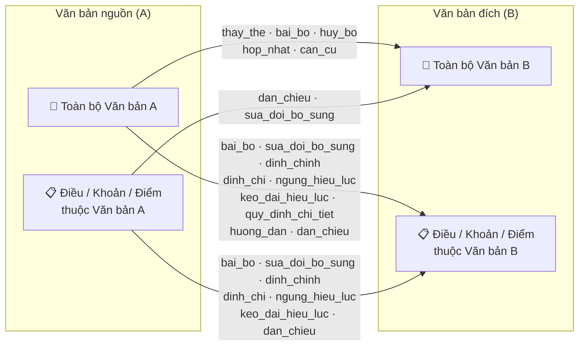
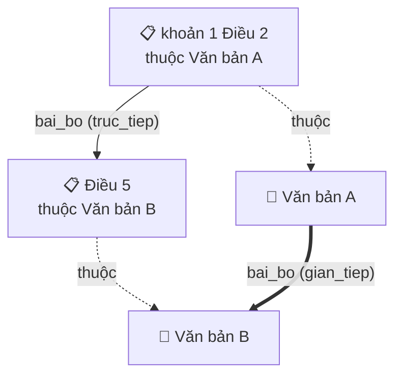

# Mô tả các loại quan hệ trong đồ thị văn bản pháp luật Việt Nam

**Phiên bản:** 1.0.0  
**Ngày cập nhật:** 2026-05-12  
**Phạm vi:** Tài liệu nội bộ.

---

## Mục lục

- [Mô tả các loại quan hệ trong đồ thị văn bản pháp luật Việt Nam](#mô-tả-các-loại-quan-hệ-trong-đồ-thị-văn-bản-pháp-luật-việt-nam)
  - [Mục lục](#mục-lục)
  - [Tóm tắt mở đầu](#tóm-tắt-mở-đầu)
  - [1. Tổng quan](#1-tổng-quan)
    - [1.1. Hai nhóm quan hệ](#11-hai-nhóm-quan-hệ)
    - [1.2. Trực tiếp vs Gián tiếp](#12-trực-tiếp-vs-gián-tiếp)
    - [1.3. Bảng tóm tắt 13 loại quan hệ và độ ưu tiên](#13-bảng-tóm-tắt-13-loại-quan-hệ-và-độ-ưu-tiên)
    - [1.4. Quan hệ nội bộ văn bản](#14-quan-hệ-nội-bộ-văn-bản)
      - [a. `BAO_GOM` — Cấu trúc phân cấp](#a-bao_gom--cấu-trúc-phân-cấp)
      - [b. `dan_chieu` nội bộ — Tham chiếu trong cùng văn bản](#b-dan_chieu-nội-bộ--tham-chiếu-trong-cùng-văn-bản)
      - [c. `bao_gom_sau_bo_sung` — Cấu trúc chèn thêm](#c-bao_gom_sau_bo_sung--cấu-trúc-chèn-thêm)
  - [2. Chi tiết từng loại quan hệ](#2-chi-tiết-từng-loại-quan-hệ)
    - [2.1. `thay_the` — Thay thế](#21-thay_the--thay-thế)
    - [2.2. `bai_bo` — Bãi bỏ](#22-bai_bo--bãi-bỏ)
    - [2.3. `huy_bo` — Hủy bỏ](#23-huy_bo--hủy-bỏ)
    - [2.4. `hop_nhat` — Hợp nhất](#24-hop_nhat--hợp-nhất)
    - [2.5. `sua_doi_bo_sung` — Sửa đổi, bổ sung](#25-sua_doi_bo_sung--sửa-đổi-bổ-sung)
    - [2.14. `bo_sung` — Bổ sung thuần túy](#214-bo_sung--bổ-sung-thuần-túy)
    - [2.15. `sua_doi` — Sửa đổi thuần túy](#215-sua_doi--sửa-đổi-thuần-túy)
    - [2.6. `dinh_chi` — Đình chỉ](#26-dinh_chi--đình-chỉ)
    - [2.7. `ngung_hieu_luc` — Ngưng hiệu lực](#27-ngung_hieu_luc--ngưng-hiệu-lực)
    - [2.8. `dinh_chinh` — Đính chính](#28-dinh_chinh--đính-chính)
    - [2.9. `keo_dai_hieu_luc` — Kéo dài hiệu lực](#29-keo_dai_hieu_luc--kéo-dài-hiệu-lực)
    - [2.10. `huong_dan` — Hướng dẫn](#210-huong_dan--hướng-dẫn)
    - [2.11. `quy_dinh_chi_tiet` — Quy định chi tiết](#211-quy_dinh_chi_tiet--quy-định-chi-tiết)
    - [2.12. `can_cu` — Căn cứ pháp lý](#212-can_cu--căn-cứ-pháp-lý)
    - [2.13. `dan_chieu` — Dẫn chiếu](#213-dan_chieu--dẫn-chiếu)
  - [3. Ràng buộc hệ thống](#3-ràng-buộc-hệ-thống)
    - [3.1. Ràng buộc thẩm quyền cấp bậc](#31-ràng-buộc-thẩm-quyền-cấp-bậc)
    - [3.2. Ràng buộc target rõ ràng](#32-ràng-buộc-target-rõ-ràng)
    - [3.3. Ràng buộc phạm vi scope](#33-ràng-buộc-phạm-vi-scope)
    - [3.4. Ràng buộc phần Căn cứ pháp lý](#34-ràng-buộc-phần-căn-cứ-pháp-lý)
    - [3.5. Ràng buộc priority](#35-ràng-buộc-priority)
    - [3.6. Ràng buộc resolve target](#36-ràng-buộc-resolve-target)
  - [4. Diagrams minh họa](#4-diagrams-minh-họa)
    - [Diagram A — Chiều edge các quan hệ nghiệp vụ](#diagram-a--chiều-edge-các-quan-hệ-nghiệp-vụ)
    - [Diagram B — Cơ chế suy luận quan hệ gián tiếp (Inferred Relations)](#diagram-b--cơ-chế-suy-luận-quan-hệ-gián-tiếp-inferred-relations)
  - [5. Glossary — Bảng thuật ngữ](#5-glossary--bảng-thuật-ngữ)
  - [6. Kết luận](#6-kết-luận)
    - [6.1. Bốn nguyên tắc cốt lõi](#61-bốn-nguyên-tắc-cốt-lõi)
    - [6.2. Các cặp dễ nhầm nhất](#62-các-cặp-dễ-nhầm-nhất)
  - [Phụ lục — Thuộc tính kỹ thuật trong Neo4j](#phụ-lục--thuộc-tính-kỹ-thuật-trong-neo4j)
    - [Node `VAN_BAN`](#node-van_ban)
    - [Node `DIEU_KHOAN`](#node-dieu_khoan)
    - [Thuộc tính của quan hệ trực tiếp (`truc_tiep`)](#thuộc-tính-của-quan-hệ-trực-tiếp-truc_tiep)
    - [Thuộc tính bổ sung cho quan hệ gián tiếp (`gian_tiep`)](#thuộc-tính-bổ-sung-cho-quan-hệ-gián-tiếp-gian_tiep)

---

## Tóm tắt mở đầu

Hệ thống xây dựng một **Đồ thị (Knowledge Graph)** liên kết các văn bản pháp luật Việt Nam. Trong graph này, mỗi văn bản (hoặc điều khoản) là một **node**; mỗi tác động pháp lý giữa hai văn bản là một **quan hệ (edge)**.

**Tại sao graph cần quan hệ?**
Graph văn bản pháp luật giúp trả lời các câu hỏi nghiệp vụ quan trọng: văn bản này còn hiệu lực không? Văn bản nào đã thay thế/bãi bỏ nó? Điều khoản nào được sửa đổi bởi văn bản nào? Nếu quan hệ sai — tạo thừa, tạo thiếu, hoặc nhầm chiều — graph sẽ cho kết quả tra cứu sai, ảnh hưởng trực tiếp đến người dùng cuối.

**Số liệu nhanh:**

- **15** loại quan hệ nghiệp vụ (13 gốc + 2 sub-type: `bo_sung`, `sua_doi`)
- **2** quan hệ cấu trúc (`BAO_GOM`, `bao_gom_sau_bo_sung`)
- **6** ràng buộc hệ thống cấm áp dụng cho mọi loại quan hệ
- **6** loại quan hệ có thể được suy luận gián tiếp từ điều khoản

---

## 1. Tổng quan

### 1.1. Hai nhóm quan hệ

| Nhóm | Quan hệ | Ý nghĩa |
|---|---|---|
| **Cấu trúc** | `BAO_GOM` | Nối cha → con trong cấu trúc văn bản gốc (Văn bản → Điều → Khoản → Điểm) |
| **Cấu trúc** | `bao_gom_sau_bo_sung` | Nối cha → con cho điều khoản **mới được chèn** bởi văn bản bổ sung |
| **Nghiệp vụ** | 15 loại | Tác động pháp lý giữa văn bản/điều khoản với nhau |

### 1.2. Trực tiếp vs Gián tiếp

Quan hệ nghiệp vụ được phân loại theo cách tạo ra:

| Loại | Tên kỹ thuật | Nguồn | Ý nghĩa |
|---|---|---|---|
| **Trực tiếp** | `truc_tiep` | Bóc tách từ nội dung văn bản | Có cue và target rõ trong text |
| **Gián tiếp** | `gian_tiep` | Suy luận từ điều khoản | Nhiều quan hệ `điều khoản - điều khoản` → gom thành quan hệ `văn bản - văn bản` |

### 1.3. Bảng tóm tắt 13 loại quan hệ và độ ưu tiên

**Tại sao có độ ưu tiên (priority)?**
Khi cùng một văn bản đích bị extract ra nhiều loại quan hệ từ cùng một văn bản nguồn, hệ thống phải giữ lại quan hệ phù hợp nhất. Priority phản ánh **mức độ tác động pháp lý**: `bai_bo` (bãi bỏ) mạnh hơn `dan_chieu` (dẫn chiếu, chỉ tham chiếu). Giữ cả hai vừa sai về mặt pháp lý, vừa gây nhiễu kết quả tra cứu.

Ví dụ: cùng target là Nghị định 78/2015, nếu có cả `bai_bo` lẫn `dan_chieu`, chỉ giữ `bai_bo`.

| Quan hệ | Tên tiếng Việt | Priority | Có thể suy luận gián tiếp? |
|---|---|---|---|
| `thay_the` | Thay thế | 100 | Có |
| `bai_bo` | Bãi bỏ | 100 | Có |
| `huy_bo` | Hủy bỏ | 100 | Có |
| `hop_nhat` | Hợp nhất | 100 | Không |
| `sua_doi_bo_sung` | Sửa đổi, bổ sung | 80 | Có |
| `sua_doi` | Sửa đổi (thuần túy) | 80 | Có |
| `bo_sung` | Bổ sung (thuần túy) | 80 | Có |
| `dinh_chi` | Đình chỉ | 80 | Có |
| `ngung_hieu_luc` | Ngưng hiệu lực | 80 | Có |
| `dinh_chinh` | Đính chính | 80 | Có |
| `keo_dai_hieu_luc` | Kéo dài hiệu lực | 70 | Có |
| `huong_dan` | Hướng dẫn | 60 | Có |
| `quy_dinh_chi_tiet` | Quy định chi tiết | 60 | Có |
| `can_cu` | Căn cứ | 40 | Không |
| `dan_chieu` | Dẫn chiếu | 20 | Có |

### 1.4. Quan hệ nội bộ văn bản

Ngoài các quan hệ **liên văn bản** (giữa hai văn bản khác nhau), đồ thị còn chứa hai loại quan hệ **trong nội bộ một văn bản**:

#### a. `BAO_GOM` — Cấu trúc phân cấp

Quan hệ cấu trúc nối cha → con trong cùng một văn bản:

```
VAN_BAN → Điều → Khoản → Điểm
```

Mỗi cấp được tạo thành node `DIEU_KHOAN` (đối với điều, khoản, điểm) và liên kết với node cha bằng `bao_gom`. Quan hệ này được xây dựng tự động từ kết quả parse cấu trúc (`cls_parsing`), **không** phải từ nội dung tham chiếu trong văn bản.

**Ví dụ:**
> *Văn bản A bao gồm Điều 1*
> *Điều 1 bao gồm khoản 1 Điều 1.*
> *khoản 1 Điều 1 bao gồm điểm a khoản 1 Điều 1.*

#### b. `dan_chieu` nội bộ — Tham chiếu trong cùng văn bản

Khi một điều khoản trong văn bản A tham chiếu đến một điều khoản khác **trong chính văn bản A** (ví dụ: *"theo quy định tại khoản 2 Điều 3 Nghị định này"*, *"căn cứ khoản 1 Điều này"*), đây là `dan_chieu` nội bộ.

| Thuộc tính | Giá trị |
|---|---|
| Loại quan hệ | `dan_chieu` |
| Source | `DIEU_KHOAN` thuộc văn bản A |
| Target | `DIEU_KHOAN` khác thuộc **cùng** văn bản A (resolve về cùng `cls_so_hieu`) |

**Cơ chế extract:** Module `InternalReferenceResolver` xử lý sau pipeline thông thường, nhận diện các pattern *"Điều này"*, *"Luật này"*, *"khoản X Điều Y của Thông tư này"*, *"từ điểm a đến điểm g khoản 1 Điều này"*,... và resolve chúng thành tham chiếu đầy đủ dùng hierarchy của văn bản. Quan hệ được tạo như `dan_chieu` thông thường.

**Ví dụ:**
> *"Điều 27. Biện pháp xử lý được chuyển hướng theo quy định tại Điều 3 của Luật này."*
> *"Mà Luật này có số hiệu: 10/2017/QH14"*

→ Tạo: `Điều 27 Luật 10/2017/QH14 --dan_chieu--> Điều 3 Luật 10/2017/QH14`

#### c. `bao_gom_sau_bo_sung` — Cấu trúc chèn thêm

Quan hệ cấu trúc nối **cha → con** dành riêng cho điều khoản **mới được chèn** vào văn bản đích bởi một văn bản bổ sung (`bo_sung`). Không tồn tại trong cấu trúc gốc của văn bản đích — được tạo tự động trong Phase 2 khi ghi quan hệ `bo_sung` có `target_key`.

**Cơ chế sinh tự động:**

Mỗi lần extractor phát hiện quan hệ `bo_sung` từ văn bản A chèn điều khoản mới vào văn bản B (`target_key` có giá trị), hệ thống `StatusRelationshipPreparationService` tự động sinh chuỗi `bao_gom_sau_bo_sung` leo từ node mới lên tới VAN_BAN cha của B:

```
VAN_BAN B --bao_gom_sau_bo_sung--> Điều mới
Điều mới --bao_gom_sau_bo_sung--> Khoản mới (nếu có)
```

**Ví dụ:**
> Văn bản A bổ sung khoản 5 vào Điều 10 của Văn bản B.

→ Tạo đồng thời:
- `VB_A --bo_sung--> khoan_5_dieu_10#B`
- `dieu_10#B --bao_gom_sau_bo_sung--> khoan_5_dieu_10#B`
- `VAN_BAN B --bao_gom_sau_bo_sung--> dieu_10#B` (nếu Điều 10 cũng là mới)

**Thuộc tính đặc biệt:**

| Thuộc tính | Giá trị |
|---|---|
| `nguon_cap_nhat` | `'cmcai'` |
| `nguon_quan_he` | Không có (không giống các quan hệ nghiệp vụ) |
| Thuộc `PRESERVED_RELATION_TYPES` | Không bao giờ bị xóa bởi host-scoped reset của B; chỉ bị xóa khi A được rebuild |

---

## 2. Chi tiết từng loại quan hệ

Mỗi quan hệ được mô tả theo cấu trúc:

1. **Định nghĩa** — ý nghĩa nghiệp vụ
2. **Chiều edge** — A → B có nghĩa gì
3. **Cue nhận biết** — từ/cụm từ trong văn bản làm dấu hiệu nhận biết
4. **Ví dụ đúng** — câu thật, quan hệ được tạo
5. **Ràng buộc** — điều kiện KHÔNG được tạo quan hệ
6. **Ví dụ sai** — vi phạm ràng buộc, giải thích lý do

---

### 2.1. `thay_the` — Thay thế

**Định nghĩa:** Văn bản A mới ban hành thay thế toàn bộ hiệu lực của văn bản B cũ. Sau khi quan hệ này tồn tại, B không còn hiệu lực.

**Chiều edge:** `A (mới) --thay_the--> B (cũ, bị thay thế)`

**Cue nhận biết:**

- `thay thế`
- `hết hiệu lực kể từ ngày [loại văn bản] này có hiệu lực thi hành`

**Ví dụ đúng:**
> *"Nghị định này thay thế Nghị định số 78/2015/NĐ-CP ngày 14 tháng 9 năm 2015 của Chính phủ."*

→ Tạo: `NĐ_mới --thay_the--> NĐ 78/2015/NĐ-CP`

> *"Nghị định số 22/2024/NĐ-CP hết hiệu lực kể từ ngày Nghị định này có hiệu lực thi hành."*

→ Tạo: `NĐ_mới --thay_the--> NĐ 22/2024/NĐ-CP`

**Ràng buộc:**

- Không dùng `thay_the` khi chỉ thay thế cụm từ, bãi bỏ từ, bỏ các cụm từ, phụ lục, chương, phần, mẫu, biểu mẫu,... trong nội dung — đó là `sua_doi_bo_sung`.
- Không dùng khi câu chỉ dẫn chiếu hoặc liệt kê mà không có hành vi thay thế rõ ràng.

**Ví dụ sai:**
> *"Thay thế cụm từ 'bảo hiểm xã hội' bằng cụm từ 'bảo hiểm xã hội bắt buộc' tại khoản 2 Điều 5."*

→ SAI khi tạo `thay_the` cho văn bản. Đây là sửa nội dung của khoản 2 Điều 5 trong văn bản, phải tạo `sua_doi_bo_sung`.

---

### 2.2. `bai_bo` — Bãi bỏ

**Định nghĩa:** Văn bản A chấm dứt hiệu lực pháp lý của văn bản/điều khoản B. Đây là hành vi bãi bỏ toàn bộ hoặc một phần.

**Chiều edge:** `A (bãi bỏ) --bai_bo--> B (bị bãi bỏ)`

**Cue nhận biết:**

- `bãi bỏ toàn bộ`
- `bãi bỏ`
- `chấm dứt hiệu lực`
- `thu hồi`
- `hết hiệu lực` (một số trường hợp không có loại văn bản theo sau)

**Ví dụ đúng:**
> *"Bãi bỏ khoản 2, khoản 3 Điều 2 và khoản 5 Điều 23 Nghị định số 118/2014/NĐ-CP."*

→ Tạo 3 relations:

- `VB_nguồn --bai_bo--> khoản 2 Điều 2 NĐ 118/2014`
- `VB_nguồn --bai_bo--> khoản 3 Điều 2 NĐ 118/2014`
- `VB_nguồn --bai_bo--> khoản 5 Điều 23 NĐ 118/2014`

**Ràng buộc:**

- Phải có target cụ thể — không tạo khi câu chỉ nói chung chung không nêu văn bản/điều khoản cụ thể.
- Phân biệt đúng điều khoản bị bãi bỏ — không được nhầm điều khoản trong câu liệt kê.
- Văn bản cấp dưới không được bãi bỏ văn bản cấp trên.

**Ví dụ sai:**
> *"Các quy định trước đây trái với Nghị định này đều bị bãi bỏ."*

→ SAI khi tạo quan hệ. Không có target cụ thể (văn bản nào? điều khoản nào?), không đủ thông tin để tạo edge.

---

### 2.3. `huy_bo` — Hủy bỏ

**Định nghĩa:** Văn bản A hủy bỏ hiệu lực của quyết định/văn bản B, thường gặp trong hành chính (thu hồi quyết định, hủy giấy phép). Phân biệt với `bai_bo`: `huy_bo` thường dùng trong các quyết định hành chính cụ thể, `bai_bo` dùng trong văn bản quy phạm pháp luật.

**Chiều edge:** `A (hủy bỏ) --huy_bo--> B (bị hủy bỏ)`

**Cue nhận biết:**

- `hủy bỏ`
- `thu hồi, hủy bỏ`
- `thu hồi và hủy bỏ`

**Ví dụ đúng:**
> *"Thu hồi và hủy bỏ Quyết định số 306/QĐ-UBND ngày 15/02/2018 của UBND tỉnh."*

→ Tạo: `QĐ_mới --huy_bo--> QĐ 306/QĐ-UBND`

**Ràng buộc:**

- Không được match nhầm văn bản có số hiệu gần giống nếu câu nêu danh sách cụ thể.
- Phân biệt `huy_bo` (hủy quyết định hành chính) với `bai_bo` (bãi bỏ quy phạm pháp luật).

**Ví dụ sai:**
> *"Hủy bỏ Quyết định số 860/QĐ-UBND và Quyết định số 1979/QĐ-UBND"*

→ SAI nếu resolver lấy nhầm `866/QĐ-UBND` thay vì `860/QĐ-UBND` do cùng prefix. Phải match đúng số hiệu.

---

### 2.4. `hop_nhat` — Hợp nhất

**Định nghĩa:** Văn bản hợp nhất (VBHN) là văn bản tổng hợp nội dung từ văn bản gốc và các văn bản sửa đổi. Quan hệ `hop_nhat` liên kết văn bản VBHN với các văn bản nguồn được hợp nhất vào.

**Chiều edge:** `VBHN (hợp nhất) --hop_nhat--> Văn bản nguồn`

**Cue nhận biết:** Số hiệu văn bản có dạng VBHN (văn bản hợp nhất), được xử lý qua luồng riêng.

**Ví dụ đúng:**
> Văn bản VBHN 01/VBHN-BTC hợp nhất Thông tư 200/2014/TT-BTC và các thông tư sửa đổi.

→ Tạo: `VBHN 01 --hop_nhat--> TT 200/2014/TT-BTC`

**Ràng buộc:**

- Chỉ áp dụng khi số hiệu là VBHN — không tự suy luận văn bản thông thường thành văn bản hợp nhất.
- Văn bản cấp dưới không được hợp nhất văn bản cấp trên.

**Ví dụ sai:**
> Văn bản A có nội dung "Hợp nhất các quy định..." nhưng không phải là VBHN chính thức.

→ SAI khi tạo `hop_nhat`. Phải có ký hiệu VBHN chính thức, không suy luận từ nội dung.

---

### 2.5. `sua_doi_bo_sung` — Sửa đổi, bổ sung

**Định nghĩa:** Văn bản A thay đổi, bổ sung một phần nội dung của văn bản/điều khoản B mà không thay thế toàn bộ. B vẫn còn hiệu lực nhưng với nội dung đã được cập nhật.

**Chiều edge:** `A (sửa đổi) --sua_doi_bo_sung--> B (bị sửa đổi)`

**Cue nhận biết:**

- `sửa đổi, bổ sung`
- `sửa đổi`
- `bổ sung`
- `thay thế cụm từ`, `bãi bỏ cụm từ`, `bỏ cụm từ`
- `thay thế phụ lục/danh mục/mẫu`
- `điều chỉnh, bổ sung`

**Ví dụ đúng:**
> *"Sửa đổi, bổ sung khoản 1 Điều 3 Thông tư số 10/2023/TT-NHNN như sau: ..."*

→ Tạo: `TT_mới --sua_doi_bo_sung--> khoản 1 Điều 3 TT 10/2023/TT-NHNN`

**Ràng buộc:**

- Thay thế cụm từ/phụ lục/mẫu trong nội dung là `sua_doi_bo_sung`, không phải `thay_the` văn bản.
- Nếu điều khoản cha có cue `sửa đổi` và điều khoản con chứa target cụ thể, phải propagate đúng target.
- Không nhầm căn cứ pháp lý phía sau thành target sửa đổi.

**Ví dụ sai:**
> Điều 2. *"Sửa đổi, bổ sung một số điều của Nghị định 126/2020/NĐ-CP"*  
> → Khoản 1: *"Sửa đổi khoản 3 Điều 15 như sau..."*

→ SAI nếu tạo target là toàn bộ Nghị định 126. Phải tạo target đúng là `khoản 3 Điều 15 NĐ 126/2020`.

> Khoản 1 Điều 9. *"Sửa đổi, bố sung Luật Sở hữu trí tuệ số 50/2005/QH11, được sửa đổi, bổ sung bởi Luật số 36/2009/QH12"*

→ SAI nếu tạo target là Luật số 36/2009/QH12. Phải tạo target đúng là `Luật Sở hữu trí tuệ số 50/2005/QH11`.

---

### 2.6. `dinh_chi` — Đình chỉ

**Định nghĩa:** Văn bản A tạm thời đình chỉ việc thi hành hoặc hiệu lực của văn bản/điều khoản B trong một khoảng thời gian nhất định. Khác với `bai_bo` (vĩnh viễn), `dinh_chi` thường là tạm thời.

**Chiều edge:** `A (đình chỉ) --dinh_chi--> B (bị đình chỉ)`

**Cue nhận biết:**

- `đình chỉ thi hành`
- `đình chỉ hiệu lực thi hành`
- `đình chỉ việc thi hành`
- `tạm đình chỉ thi hành`

**Ví dụ đúng:**
> *"Đình chỉ thi hành Điều 5 Thông tư 25/2022/TT-BTC kể từ ngày ký."*

→ Tạo: `VB_nguồn --dinh_chi--> Điều 5 TT 25/2022/TT-BTC`

**Ràng buộc:**

- Không tạo `dinh_chi` khi câu chỉ nói cơ quan kiểm sát/giám sát việc Tòa án ra quyết định đình chỉ — đó là nghiệp vụ tư pháp, phải tạo `dan_chieu`.
- Văn bản cấp dưới không được đình chỉ văn bản cấp trên.

**Ví dụ sai:**
> *"Viện kiểm sát nhân dân có quyền kiểm sát việc Tòa án ra quyết định đình chỉ thi hành án theo quy định tại khoản 3 Điều 14 Nghị định này."*

→ SAI khi tạo `dinh_chi`. Câu này mô tả thẩm quyền giám sát, không có hành vi đình chỉ văn bản. Đúng ra là `dan_chieu` đến khoản 3 Điều 14 Nghị định này.

---

### 2.7. `ngung_hieu_luc` — Ngưng hiệu lực

**Định nghĩa:** Văn bản A làm ngưng hiệu lực thi hành của văn bản/điều khoản B trong một thời hạn hoặc đến khi có quyết định khác.

**Chiều edge:** `A (ngưng) --ngung_hieu_luc--> B (bị ngưng hiệu lực)`

**Cue nhận biết:**

- `ngưng hiệu lực`
- `ngưng hiệu lực thi hành`
- `ngưng hiệu lực toàn bộ`

**Ví dụ đúng:**
> *"Ngưng hiệu lực thi hành toàn bộ Thông tư số 12/2021/TT-BCT kể từ ngày 01/01/2026."*

→ Tạo: `VB_nguồn --ngung_hieu_luc--> TT 12/2021/TT-BCT`

**Ràng buộc:**

- Target phải là điều khoản **đang có hiệu lực**, không phải phiên bản cũ đã bị sửa đổi. Nếu một điều khoản đã được sửa đổi, phiên bản cũ không còn tồn tại trong thực tế — ngưng hiệu lực phải nhắm vào phiên bản mới nhất đang áp dụng.
- Văn bản cấp dưới không được ngưng hiệu lực văn bản cấp trên.

**Ví dụ sai:**
> Bối cảnh: Khoản 3 Điều 10 Luật X đã được **sửa đổi** bởi Luật Y năm 2022, nội dung đã thay đổi hoàn toàn.
>
> Câu trong văn bản mới: *"Ngưng hiệu lực khoản 3 Điều 10 Luật X."*

→ SAI nếu hệ thống map target về bản gốc của khoản 3 Điều 10 trước khi Luật Y sửa đổi. Phải map về **phiên bản đang có hiệu lực** (tức bản đã được Luật Y sửa đổi), vì đó là nội dung thực tế đang áp dụng.

---

### 2.8. `dinh_chinh` — Đính chính

**Định nghĩa:** Văn bản A đính chính sai sót kỹ thuật, lỗi chính tả, hoặc nội dung của văn bản B. Không thay đổi bản chất pháp lý mà chỉ sửa lỗi.

**Chiều edge:** `A (đính chính) --dinh_chinh--> B (được đính chính)`

**Cue nhận biết:**

- `đính chính`
- `đính chính sai sót`
- `đính chính nội dung`
- `đính chính lỗi kỹ thuật`
- `sửa tiêu đề`
- `sửa cụm từ` (khi là đính chính lỗi)

**Ví dụ đúng:**
> *"Công văn đính chính nội dung kèm theo Quyết định số 1902/QĐ-UBND ngày 10/05/2025."*

→ Tạo: `Công văn --dinh_chinh--> QĐ 1902/QĐ-UBND`

**Ràng buộc:**

- Không tạo khi hành động chỉ liên quan đến đính chính giấy tờ hành chính (giấy phép, chứng chỉ) mà không phải đính chính nội dung văn bản quy phạm.

**Ví dụ sai:**
> *"Đính chính thông tin trên Giấy chứng nhận đăng ký kinh doanh số 0123456789."*

→ SAI khi tạo `dinh_chinh` cho văn bản. Đây là đính chính giấy tờ hành chính, không phải đính chính văn bản pháp luật.

---

### 2.9. `keo_dai_hieu_luc` — Kéo dài hiệu lực

**Định nghĩa:** Văn bản A gia hạn thêm thời gian có hiệu lực hoặc thời hạn áp dụng của văn bản/quy định B.

**Chiều edge:** `A (kéo dài) --keo_dai_hieu_luc--> B (được kéo dài)`

**Cue nhận biết:**

- `kéo dài hiệu lực`
- `kéo dài thời hạn`
- `kéo dài thời gian`
- `thống nhất tiếp tục kéo dài hiệu lực/thời hạn/thời gian`

**Ví dụ đúng:**
> *"Thống nhất tiếp tục kéo dài thời gian thực hiện Nghị quyết số 30/NQ-CP đến hết ngày 31/12/2026."*

→ Tạo: `VB_nguồn --keo_dai_hieu_luc--> NQ 30/NQ-CP`

**Ràng buộc:**

- Không tạo nếu văn bản chỉ căn cứ hoặc nhắc gián tiếp tới luật/quy hoạch mà không có hành vi kéo dài hiệu lực thật sự của target đó.
- Văn bản cấp dưới không được kéo dài hiệu lực văn bản cấp trên.

**Ví dụ sai:**
> *"Căn cứ Luật Ngân sách nhà nước, Chính phủ ban hành Nghị định này nhằm kéo dài thời gian áp dụng các biện pháp hỗ trợ..."*

→ SAI khi tạo `keo_dai_hieu_luc` cho Luật Ngân sách. Câu này chỉ dẫn căn cứ, không có hành vi kéo dài hiệu lực Luật Ngân sách.

---

### 2.10. `huong_dan` — Hướng dẫn

**Định nghĩa:** Văn bản A hướng dẫn cách thực hiện, thi hành hoặc áp dụng văn bản B. A thường là văn bản cấp dưới chi tiết hóa cách thực thi B.

**Chiều edge:** `A (hướng dẫn) --huong_dan--> B (được hướng dẫn)`

**Cue nhận biết:**

- `hướng dẫn thi hành`
- `hướng dẫn thực hiện`
- `hướng dẫn áp dụng`

**Ví dụ đúng:**
> *"Thông tư này hướng dẫn thi hành một số điều của Nghị định số 22/2024/NĐ-CP."*

→ Tạo: `TT_nguồn --huong_dan--> NĐ 22/2024/NĐ-CP`

**Ràng buộc:**

- Không tạo `huong_dan` từ danh sách văn bản trong phần "Căn cứ" đầu văn bản nếu nội dung operative không nói rõ văn bản nguồn đang hướng dẫn các văn bản đó.
- Không lấy văn bản lịch sử hoặc văn bản được nhắc trong tiêu đề sửa đổi làm target.

**Ví dụ sai:**
> *"Căn cứ Luật Doanh nghiệp số 59/2020/QH14; Căn cứ Luật Đầu tư số 61/2020/QH14; Chính phủ ban hành Nghị định..."*

→ SAI khi tạo `huong_dan` cho Luật 59 và Luật 61. Phần "Căn cứ" chỉ liệt kê cơ sở pháp lý, không phải hành vi hướng dẫn.

---

### 2.11. `quy_dinh_chi_tiet` — Quy định chi tiết

**Định nghĩa:** Văn bản A quy định chi tiết nội dung của một điều/khoản/điểm trong văn bản B mà văn bản B giao cho cơ quan cấp dưới hướng dẫn cụ thể.

**Chiều edge:** `A (quy định chi tiết) --quy_dinh_chi_tiet--> B (được quy định chi tiết)`

**Cue nhận biết:**

- `quy định chi tiết`
- `quy định chi tiết và hướng dẫn thi hành`

**Ví dụ đúng:**
> *"Nghị định này quy định chi tiết khoản 3 Điều 25 và khoản 2 Điều 30 Luật Đất đai số 31/2024/QH15."*

→ Tạo:

- `NĐ_nguồn --quy_dinh_chi_tiet--> khoản 3 Điều 25 Luật 31/2024/QH15`
- `NĐ_nguồn --quy_dinh_chi_tiet--> khoản 2 Điều 30 Luật 31/2024/QH15`

**Ràng buộc:**

- Không tạo khi chỉ có căn cứ pháp lý ở đầu văn bản.
- Không tạo khi câu chỉ dẫn chiếu hoặc áp dụng theo luật, không có hành vi quy định chi tiết.
- Target phải là điều/khoản/điểm cụ thể được giao quy định chi tiết, không phải toàn bộ văn bản.

**Ví dụ sai:**
> Phần mở đầu Nghị định: *"Căn cứ Luật Quản lý thuế số 38/2013/QH13; Chính phủ ban hành Nghị định..."*

→ SAI khi tạo `quy_dinh_chi_tiet` cho Luật 38. Lý do: "Căn cứ Luật..." chỉ là cơ sở pháp lý để Nghị định được ban hành, không có nghĩa là Nghị định đó đang "quy định chi tiết" Luật đó. Quan hệ đúng ở đây là `can_cu`. Muốn tạo `quy_dinh_chi_tiet`, văn bản phải nêu rõ điều/khoản cụ thể được giao, ví dụ: *"Nghị định này quy định chi tiết khoản 3 Điều 25 Luật Quản lý thuế."*

---

### 2.12. `can_cu` — Căn cứ pháp lý

**Định nghĩa:** Văn bản A được ban hành dựa trên căn cứ pháp lý là văn bản B. B là cơ sở pháp lý trao thẩm quyền cho A. Quan hệ này được trích xuất từ phần "Căn cứ..." ở đầu văn bản.

**Chiều edge:** `A (văn bản hiện tại) --can_cu--> B (văn bản căn cứ)`

**Cue nhận biết:** Phần mở đầu văn bản bắt đầu bằng "Căn cứ..." — được tách riêng bằng thuật toán `extract_can_cu_section`.

**Ví dụ đúng:**
> *"Căn cứ Luật Tổ chức Chính phủ ngày 19 tháng 6 năm 2015..."*  
> *"Căn cứ Nghị định số 20/2022/NĐ-CP ngày 10 tháng 3 năm 2022..."*

→ Tạo:

- `VB_nguồn --can_cu--> Luật Tổ chức Chính phủ`
- `VB_nguồn --can_cu--> NĐ 20/2022/NĐ-CP`

**Ràng buộc:**

- Phần "Căn cứ" không tự động sinh các action relation như `huong_dan`, `quy_dinh_chi_tiet`, `bai_bo` — trừ khi nội dung operative phía sau thật sự có cue và target rõ.
- Không tạo `can_cu` từ các văn bản được nhắc trong nội dung (chỉ từ phần căn cứ đầu văn bản).

**Ví dụ sai:**
> Trong nội dung Điều 3: *"Thực hiện theo quy định tại Luật Doanh nghiệp số 59/2020/QH14."*

→ SAI khi tạo `can_cu` từ câu này. Câu trong nội dung chỉ là `dan_chieu`, không phải căn cứ pháp lý. `can_cu` chỉ được tạo từ phần "Căn cứ..." đầu văn bản.

---

### 2.13. `dan_chieu` — Dẫn chiếu

**Định nghĩa:** Văn bản/điều khoản A dẫn chiếu, tham chiếu đến văn bản/điều khoản B để áp dụng hoặc viện dẫn quy định. Đây là quan hệ có mức độ tác động thấp nhất — B không bị thay đổi hiệu lực.

**Chiều edge:** `A (dẫn chiếu) --dan_chieu--> B (được dẫn chiếu)`

**Cue nhận biết:**

- `theo quy định tại...`
- `theo quy định của...`
- `được quy định tại...`
- `được quy định trong...`
- `thuộc phạm vi điều chỉnh của...`
- `trên cơ sở...`
- `tại Điều/Khoản/Điểm... [văn bản]`

**Ví dụ đúng:**
> *"Mức hỗ trợ thực hiện theo quy định tại khoản 2 Điều 5 Luật Việc làm số 38/2013/QH13."*

→ Tạo: `VB_nguồn --dan_chieu--> khoản 2 Điều 5 Luật 38/2013/QH13`

**Ràng buộc:**

- Không tạo `dan_chieu` khi target đó đã có relation mạnh hơn (`bai_bo`, `thay_the`, `sua_doi_bo_sung`, `dinh_chi`, `dinh_chinh`, `ngung_hieu_luc`).
- Không tạo khi cụm là "và quy định khác của pháp luật có liên quan" — không có target cụ thể.
- Không tạo khi câu chỉ là **điều kiện nội bộ trong ngoại lệ hiệu lực/bãi bỏ/thay thế**: một số câu có cú pháp dẫn chiếu nhưng thực chất chỉ mô tả điều kiện để hành vi chính (bãi bỏ, thay thế, hết hiệu lực) có hiệu lực — văn bản được nhắc không phải mục tiêu dẫn chiếu thật. Ví dụ: *"Nghị định 10/2020 hết hiệu lực kể từ ngày Nghị định này có hiệu lực"* — cụm "Nghị định này" chỉ là điều kiện thời gian, không tạo `dan_chieu` cho Nghị định hiện tại.
- Không tạo khi nội dung trong ngoặc chỉ là **lịch sử sửa đổi**: một số điều khoản ghi chú trong ngoặc tên văn bản đã từng sửa đổi nó, ví dụ *"khoản 3 Điều 10 (được sửa đổi bởi Luật số 45/2019/QH14)"*. Cụm trong ngoặc chỉ ghi nhận lịch sử, không phải hành vi dẫn chiếu — target thật của điều khoản đó đã nằm ngoài ngoặc rồi, không tạo thêm `dan_chieu` cho Luật 45.

**Ví dụ sai:**
> *"Xử lý vi phạm theo quy định tại Nghị định 22/2024/NĐ-CP và quy định khác của pháp luật có liên quan."*

→ SAI nếu tạo `dan_chieu` cho cả "quy định khác của pháp luật có liên quan" — không có target cụ thể. Chỉ được tạo `dan_chieu` cho NĐ 22/2024/NĐ-CP.

**Trường hợp đặc biệt — Dẫn chiếu nội bộ:**

Khi target nằm trong **cùng văn bản** với source (cue: *"Điều này"*, *"khoản X Điều Y của Nghị định/Luật/Thông tư này"*), loại quan hệ vẫn là `dan_chieu` — target được resolve về cùng `cls_so_hieu`. Xem thêm **[Mục 1.4.b](#14-quan-hệ-nội-bộ-văn-bản)**.

---

### 2.14. `bo_sung` — Bổ sung thuần túy

**Định nghĩa:** Văn bản A **chèn thêm** một điều/khoản/điểm hoàn toàn mới vào văn bản/điều khoản B. Khác với `sua_doi_bo_sung` (sửa đổi kết hợp bổ sung), `bo_sung` thuần túy không thay đổi nội dung hiện có — nó tạo ra nội dung mới chưa tồn tại trong cấu trúc gốc của B.

Đây là sub-type được tinh chỉnh từ cue `sua_doi_bo_sung`. Extractor nhận diện ngữ cảnh và quyết định dùng `bo_sung` khi hành động là **thêm mới thuần túy** (không có thành phần sửa đổi).

**Chiều edge:** `A (bổ sung) --bo_sung--> DIEU_KHOAN mới trong B`

**Cue nhận biết:** Cùng cue với `sua_doi_bo_sung` — được phân loại tại bước tinh chỉnh sau khi match:

- `bổ sung ... vào Điều/Khoản ...`
- `thêm ... vào Điều/Khoản ...`

**Ví dụ đúng:**
> *"Bổ sung khoản 5 vào Điều 10 Nghị định số 22/2024/NĐ-CP như sau: ..."*

→ Tạo: `VB_nguồn --bo_sung--> khoan_5_dieu_10#<cls_ID NĐ 22/2024>`

Đồng thời hệ thống tự động tạo:

- `dieu_10#<cls_ID> --bao_gom_sau_bo_sung--> khoan_5_dieu_10#<cls_ID>`

**Ràng buộc:**

- Chỉ dùng khi điều khoản target là **nội dung mới** — chưa tồn tại trong cấu trúc gốc của B. Nếu điều khoản đã tồn tại và chỉ thay đổi nội dung → `sua_doi`.
- Luôn đi kèm với `bao_gom_sau_bo_sung` được tự động sinh ra (xem **[Mục 1.4.c](#c-bao_gom_sau_bo_sung--cấu-trúc-chèn-thêm)**).
- Văn bản cấp dưới không được bổ sung vào văn bản cấp trên.

**Ví dụ sai:**
> *"Sửa đổi khoản 1 Điều 3 như sau: ..."* (khoản 1 đã tồn tại)

→ SAI khi tạo `bo_sung`. Khoản 1 đã có trong cấu trúc gốc, đây là hành vi sửa đổi nội dung hiện có → phải tạo `sua_doi`.

---

### 2.15. `sua_doi` — Sửa đổi thuần túy

**Định nghĩa:** Văn bản A **thay đổi nội dung** của một điều/khoản/điểm **đã tồn tại** trong văn bản B, không thêm cấu trúc mới. Đây là sub-type được tinh chỉnh từ `sua_doi_bo_sung` khi hành động là **sửa đổi thuần túy** (không có thành phần bổ sung).

Trong đồ thị, `sua_doi` không tạo node `DIEU_KHOAN` mới và không sinh `bao_gom_sau_bo_sung`. Nó chỉ ghi nhận tác động sửa nội dung hiện có.

**Chiều edge:** `A (sửa đổi) --sua_doi--> DIEU_KHOAN đã tồn tại trong B`

**Cue nhận biết:** Cùng cue với `sua_doi_bo_sung` — được phân loại tại bước tinh chỉnh sau khi match:

- `sửa đổi Điều/Khoản ...`
- `thay thế cụm từ ... tại Điều/Khoản ...`
- `bãi bỏ cụm từ ... tại Điều/Khoản ...`

**Ví dụ đúng:**
> *"Sửa đổi khoản 1 Điều 3 Thông tư số 10/2023/TT-NHNN như sau: ..."*

→ Tạo: `TT_mới --sua_doi--> khoan_1_dieu_3#<cls_ID TT 10/2023>`

> *"Thay thế cụm từ 'bảo hiểm xã hội' bằng 'bảo hiểm xã hội bắt buộc' tại khoản 2 Điều 5."*

→ Tạo: `VB_nguồn --sua_doi--> khoan_2_dieu_5#<cls_ID văn bản đích>`

**Ràng buộc:**

- Target phải là điều khoản **đã tồn tại** trong B. Nếu điều khoản chưa tồn tại → `bo_sung`.
- Không tạo khi target là toàn bộ văn bản — `sua_doi` luôn nhắm vào điều/khoản/điểm cụ thể (`DIEU_KHOAN`).
- Không nhầm với `thay_the`: thay cụm từ/phụ lục/nội dung điều khoản là `sua_doi`; thay thế toàn bộ văn bản là `thay_the`.
- Văn bản cấp dưới không được sửa đổi văn bản cấp trên.

**Ví dụ sai:**
> *"Nghị định này thay thế Nghị định số 78/2015/NĐ-CP."*

→ SAI khi tạo `sua_doi` cho Nghị định 78. Đây là hành vi thay thế toàn bộ văn bản → phải tạo `thay_the`.

---

## 3. Ràng buộc hệ thống

Các ràng buộc sau áp dụng **cho mọi loại quan hệ**, bất kể loại cụ thể là gì.

### 3.1. Ràng buộc thẩm quyền cấp bậc

**Nguyên tắc cốt lõi:** Văn bản cấp dưới **không được** tạo action relation lên văn bản cấp trên.

**Thứ bậc văn bản pháp luật Việt Nam (từ cao → thấp):**

```
1.  Hiến pháp
      ↓
2.  Luật / Bộ luật / Nghị quyết Quốc hội
      ↓
3.  Pháp lệnh / Nghị quyết UBTVQH
    (+ Nghị quyết liên tịch UBTVQH – MTTQ; UBTVQH – CP – MTTQ)
      ↓
4.  Lệnh / Quyết định Chủ tịch nước
      ↓
5.  Nghị định / Nghị quyết Chính phủ
    (+ Nghị quyết liên tịch CP – MTTQ)
      ↓
6.  Quyết định Thủ tướng
      ↓
7.  Nghị quyết Hội đồng Thẩm phán TAND Tối cao
      ↓
8.  Thông tư Chánh án TAND Tối cao
    Thông tư Viện trưởng VKSND Tối cao
    Thông tư Bộ trưởng / Thủ trưởng cơ quan ngang Bộ
    Thông tư Tổng Kiểm toán Nhà nước
      ↓
9.  Thông tư liên tịch (giữa các cơ quan trên)
      ↓
10. Nghị quyết HĐND tỉnh
      ↓
11. Quyết định UBND tỉnh
      ↓
12. VBQPPL chính quyền đơn vị hành chính – kinh tế đặc biệt
      ↓
13. Nghị quyết HĐND huyện/xã
      ↓
14. Quyết định UBND huyện/xã
```

**Quan hệ bị chặn khi source thấp hơn target:**

| Quan hệ bị chặn | Lý do |
|---|---|
| `bai_bo` · `thay_the` · `huy_bo` | Cấp dưới không có thẩm quyền hủy bỏ / thay thế văn bản cấp trên |
| `sua_doi_bo_sung` · `dinh_chinh` | Cấp dưới không được sửa nội dung văn bản cấp trên |
| `dinh_chi` · `ngung_hieu_luc` · `keo_dai_hieu_luc` | Cấp dưới không kiểm soát hiệu lực văn bản cấp trên |
| `hop_nhat` | Chỉ cơ quan có thẩm quyền mới được hợp nhất văn bản |

**Ví dụ minh họa:**

| Tình huống | Kết quả |
|---|---|
| Thông tư hướng dẫn thi hành Nghị định | ✅ Hợp lệ — `huong_dan` đi từ cấp dưới lên cấp trên là đúng chiều |
| Nghị định quy định chi tiết một điều của Luật | ✅ Hợp lệ — `quy_dinh_chi_tiet` đi từ cấp dưới, chi tiết hóa cấp trên |
| Quyết định UBND tỉnh bãi bỏ Nghị định Chính phủ | ❌ Bị chặn — cấp dưới không có thẩm quyền bãi bỏ cấp trên |
| Thông tư Bộ thay thế Luật | ❌ Bị chặn — vi phạm thứ bậc thẩm quyền |
| Quyết định UBND huyện sửa đổi Nghị quyết HĐND tỉnh | ❌ Bị chặn — UBND huyện thấp hơn HĐND tỉnh |

### 3.2. Ràng buộc target rõ ràng

**Nguyên tắc:** Chỉ tạo quan hệ khi xác định được **đúng một** văn bản đích. Nếu thông tin trong văn bản không đủ để phân biệt, không được đoán — bỏ qua hoặc giữ ở `failed` để audit.

| Tình huống | Vấn đề | Cách xử lý |
|---|---|---|
| Văn bản nhắc "Nghị định 45" nhưng có hai Nghị định số 45 ban hành khác năm | Không biết đây là bản nào | Không tạo quan hệ |
| Văn bản nhắc "Luật Doanh nghiệp" nhưng đã có 3 phiên bản Luật Doanh nghiệp qua các năm | Không rõ phiên bản nào | Không tạo quan hệ |
| Văn bản chỉ ghi "Luật Doanh nghiệp năm 2020" và chỉ có đúng một Luật như vậy | Xác định được rõ ràng | Tạo quan hệ bình thường |
| Văn bản nhắc "theo quy định của pháp luật có liên quan" | Không có văn bản cụ thể | Không tạo quan hệ |
| Văn bản nhắc "Thông tư 10" nhưng không ghi Bộ ban hành, không ghi năm | Có thể là Thông tư 10 của nhiều Bộ khác nhau | Không tạo quan hệ |

### 3.3. Ràng buộc phạm vi scope

Reference chỉ được match với relation cue trong phạm vi hợp lý:

- Ưu tiên reference trong cùng câu hoặc cùng đoạn
- Không kéo reference qua dấu chấm, xuống dòng hoặc relation cue khác nếu không có rule rõ
- Không nuốt cụm mô tả chung như `và quy định khác của pháp luật có liên quan` thành target cụ thể

### 3.4. Ràng buộc phần Căn cứ pháp lý

Phần "Căn cứ..." đầu văn bản **không tự động sinh** các action relation sau:

- `huong_dan`
- `quy_dinh_chi_tiet`
- `bai_bo`
- `sua_doi_bo_sung`
- `thay_the`

Chỉ sinh `can_cu`. Các action relation chỉ được tạo từ nội dung operative phía sau có cue và target rõ.

### 3.5. Ràng buộc priority

Khi cùng một target có nhiều relation từ cùng một source:

- Giữ relation có priority cao hơn
- Xóa `dan_chieu` nếu đã có relation mạnh hơn cùng target
- Ngoại lệ: `keo_dai_hieu_luc` và `dan_chieu` có thể cùng tồn tại trong một số trường hợp đã được xác nhận (vừa có hiệu lực kéo dài, vừa có dẫn chiếu thật)

### 3.6. Ràng buộc resolve target

Không tạo edge chính thức nếu không resolve được `target_doc_id`. Các mention chưa resolve được chỉ được giữ ở `cls_graph.failed` để audit — không được tạo quan hệ trong Neo4j.

---

## 4. Diagrams minh họa

### Diagram A — Chiều edge các quan hệ nghiệp vụ

Quan hệ có thể kết nối ở **hai cấp độ**: toàn bộ văn bản (`VAN_BAN`) hoặc điều/khoản/điểm cụ thể (`DIEU_KHOAN`). Chiều mũi tên cho biết "ai tác động lên ai".



**Đọc sơ đồ:**

| Cạnh | Ý nghĩa | Ví dụ thực tế |
|---|---|---|
| `VAN_BAN A → VAN_BAN B` | Tác động toàn bộ văn bản/Tác động một phần (Quan hệ gián tiếp) | "Nghị định này thay thế Nghị định 78/2015" |
| `DIEU_KHOAN A → DIEU_KHOAN B` | Điều khoản của A tác động điều khoản của B | "Sửa đổi khoản 1 Điều 3 Thông tư 10/2023" |
| `DIEU_KHOAN A → VAN_BAN B` | Điều khoản của A dẫn chiếu/tác động toàn bộ B | "Theo quy định tại Luật Doanh nghiệp số 59/2020" |

**Lưu ý:** Quan hệ `hop_nhat`, `can_cu` chỉ tồn tại ở cấp văn bản - văn bản. Các quan hệ còn lại có thể hoạt động ở cả hai cấp độ.

---

### Diagram B — Cơ chế suy luận quan hệ gián tiếp (Inferred Relations)

Khi các điều khoản giữa hai văn bản có quan hệ trực tiếp, hệ thống suy luận thành quan hệ văn bản - văn bản gián tiếp (`gian_tiep`).



> Mũi tên đơn `-->`: quan hệ **trực tiếp** giữa hai điều khoản. Mũi tên đậm `==>`: quan hệ **gián tiếp** được suy luận tự động giữa hai văn bản.

**Giải thích:**

1. Extractor phát hiện: `khoản 1 Điều 2 (VB A)` bãi bỏ `Điều 5 (VB B)` → quan hệ điều khoản - điều khoản **trực tiếp**
2. Hệ thống suy luận: vì một điều khoản của A tác động lên một điều khoản của B → tạo thêm quan hệ sửa đổi, bổ sung **gián tiếp** giữa văn bản A và văn bản B
3. Quan hệ gián tiếp lưu thêm metadata: `danh_sach_id_lien_quan` (map điều khoản A → điều khoản B), `moi_quan_he_goc` (danh sách các loại quan hệ gốc của các điều khoản), `loai_quan_he` là `gian_tiep`.

**6 loại quan hệ gián tiếp:**
`sua_doi_bo_sung`, `dinh_chinh`, `huong_dan`, `keo_dai_hieu_luc`, `dan_chieu`, `ngung_hieu_luc`

**Lưu ý:** Chỉ `dieu`, `khoan`, `diem` tham gia suy luận. Không suy luận từ `muc`, `phan`, `chuong`, `tieumuc`, `bieumau`,....

---

## 5. Glossary — Bảng thuật ngữ

| Thuật ngữ | Giải thích |
|---|---|
| `VAN_BAN` | Node văn bản pháp luật trong graph (Luật, Nghị định, Thông tư, Quyết định...) |
| `DIEU_KHOAN` | Node điều/khoản/điểm cụ thể trong văn bản |
| `BAO_GOM` | Quan hệ cấu trúc cha → con: VAN_BAN → Điều → Khoản → Điểm (cấu trúc gốc) |
| `bao_gom_sau_bo_sung` | Quan hệ cấu trúc cha → con cho điều khoản mới được chèn bởi `bo_sung`; không xóa bởi host-scoped reset |
| `bo_sung` | Sub-type của `sua_doi_bo_sung`: bổ sung thuần túy — chèn điều khoản mới vào văn bản đích |
| `sua_doi` | Sub-type của `sua_doi_bo_sung`: sửa đổi thuần túy — thay đổi nội dung điều khoản đã tồn tại |
| `cls_ID` | Mã định danh số nguyên của văn bản trong hệ thống (ví dụ: `12345`) |
| `ID (DIEU_KHOAN)` | Định dạng `<com_key>#<cls_ID>`, ví dụ: `khoan_1_dieu_2#12345` |
| `truc_tiep` | Quan hệ bóc tách trực tiếp từ nội dung văn bản — có cue và target rõ |
| `gian_tiep` | Quan hệ suy luận từ các quan hệ điều khoản, không có cue trực tiếp |
| `nguon_cap_nhat` | Nguồn tạo quan hệ: `cmcai` (thuật toán nội bộ) hoặc `tvpl` (từ TVPL) |
| Priority | Độ ưu tiên khi xung đột nhiều quan hệ cùng target: 100 (mạnh nhất) → 20 (yếu nhất) |
| TVPL | Nền tảng tra cứu pháp luật bên thứ ba — dùng làm nguồn bổ sung quan hệ |
| VBHN | Văn bản hợp nhất — tổng hợp văn bản gốc và các văn bản sửa đổi |

---

## 6. Kết luận

### 6.1. Bốn nguyên tắc cốt lõi

1. **Chiều edge phản ánh tác động pháp lý**: `A → B` luôn có nghĩa A là "chủ thể hành động", B là "đối tượng bị tác động". Không được đảo chiều.

2. **Priority quyết định xung đột**: Khi cùng target có nhiều relation, loại mạnh hơn thắng. `dan_chieu` luôn thua trước `bai_bo`, `thay_the`, `sua_doi_bo_sung`.

3. **Không có target rõ ràng thì không tạo edge**: Nếu không resolve được văn bản đích (target ambiguous, thiếu thông tin), không được tạo quan hệ. Chỉ lưu vào `failed` để audit.

4. **Phần Căn cứ không sinh action relation**: "Căn cứ Luật X..." chỉ tạo `can_cu`, không tạo `bai_bo`, `huong_dan`, `quy_dinh_chi_tiet`.

### 6.2. Các cặp dễ nhầm nhất

| Cặp | Dấu hiệu phân biệt |
|---|---|
| `thay_the` vs `sua_doi_bo_sung` | Thay cụm từ/phụ lục → `sua_doi_bo_sung`; thay toàn bộ văn bản → `thay_the` |
| `bo_sung` vs `sua_doi` | Điều khoản **mới** (chưa tồn tại trong B) → `bo_sung`; điều khoản **đã tồn tại** (sửa nội dung) → `sua_doi` |
| `bo_sung` vs `sua_doi_bo_sung` | `bo_sung` / `sua_doi` là sub-type được tinh chỉnh từ cùng cue; `sua_doi_bo_sung` là dạng tổng hợp (kết hợp cả hai hoặc chưa phân định) |
| `bai_bo` vs `huy_bo` | Văn bản quy phạm → `bai_bo`; quyết định hành chính cụ thể → `huy_bo` |
| `huong_dan` vs `quy_dinh_chi_tiet` | Hướng dẫn thi hành → `huong_dan`; quy định chi tiết điều khoản được giao → `quy_dinh_chi_tiet` |
| `dinh_chi` vs `dan_chieu` | Hành vi đình chỉ thật → `dinh_chi`; câu nghiệp vụ nhắc đến đình chỉ → `dan_chieu` |

---

## Phụ lục — Thuộc tính kỹ thuật trong Neo4j

*(Dành cho dev và người cần tra cứu chi tiết kỹ thuật)*

---

### Node `VAN_BAN`

Mỗi văn bản pháp luật có `cls_ID` hợp lệ đều được tạo thành một node `VAN_BAN` trong Neo4j.

| Thuộc tính | Ý nghĩa |
|---|---|
| `ID` | `cls_ID` — mã định danh số nguyên (khóa duy nhất) |
| `name` | Loại văn bản (`Luật`, `Nghị định`, `Thông tư`...) |
| `ten_day_du` | Tên đầy đủ / title văn bản |
| `so_hieu` | Số hiệu văn bản (ví dụ: `59/2020/QH14`) |
| `trich_yeu` | Trích yếu nội dung |
| `tinh_trang_hieu_luc` | Tình trạng hiệu lực hiện tại |
| `ngay_ban_hanh` | Ngày ban hành |
| `ngay_co_hieu_luc` | Ngày có hiệu lực |
| `ngay_het_hieu_luc` | Ngày hết hiệu lực (nếu có) |
| `co_quan_ban_hanh` | Cơ quan ban hành |
| `loai_van_ban` | Phân loại văn bản theo nghiệp vụ |
| `thoi_gian_cap_nhat` | Thời điểm cập nhật vào graph |

---

### Node `DIEU_KHOAN`

Được tạo từ `cls_parsing` cho các cấp: **điều**, **khoản**, **điểm**. Không tạo node riêng cho mục/phần/chương trong luồng hiện tại.

**Quy tắc ID:** `<com_key>#<cls_ID>`

Ví dụ: `dieu_2#12345`, `khoan_3_dieu_2#12345`, `diem_b4_khoan_11_dieu_13#12345`

| Thuộc tính | Ý nghĩa |
|---|---|
| `ID` | `<com_key>#<cls_ID>` — khóa duy nhất |
| `cap_do` | Cấp độ: `dieu`, `khoan`, hoặc `diem` |
| `tieu_de` | Tiêu đề điều khoản (nếu có) |
| `vi_tri` | Đường dẫn vị trí trong cấu trúc văn bản (com_path) |
| `vi_tri_chi_tiet` | Chuỗi tên cấp cha đầy đủ (com_titles_name) |
| Metadata văn bản | Kế thừa các trường chung từ node `VAN_BAN` cha |

---

### Thuộc tính của quan hệ trực tiếp (`truc_tiep`)

| Thuộc tính | Bắt buộc | Giá trị hợp lệ | Ý nghĩa |
|---|---|---|---|
| `nguon_cap_nhat` | Có | `cmcai`, `tvpl` | Nguồn cập nhật quan hệ |
| `thoi_gian_cap_nhat` | Có | Timestamp | Thời điểm cập nhật |

### Thuộc tính bổ sung cho quan hệ gián tiếp (`gian_tiep`)

| Thuộc tính | Ý nghĩa |
|---|---|
| `loai_quan_he` | Luôn là `gian_tiep` |
| `danh_sach_id_lien_quan` | Map điều khoản nguồn → điều khoản đích (bắt buộc có) |
| `moi_quan_he_goc` | Danh sách loại quan hệ gốc đã tạo ra quan hệ gián tiếp này |
| `mo_ta` | Mô tả/bằng chứng tổng hợp từ nhiều quan hệ điều khoản |
| `nguon_cap_nhat` | Hệ thống cập nhật quan hệ |
| `thoi_gian_cap_nhat` | Thời điểm cập nhật |
